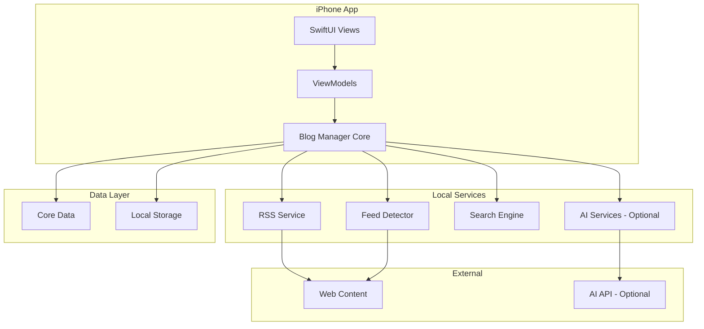
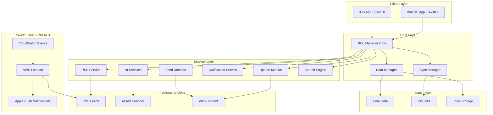

# Design Document: Bookmark Manager

## Overview

AIエンジニア向けの技術ブログ管理ツールの設計ドキュメント。段階的実装アプローチを採用し、Phase 1ではiPhone MVPをローカル保存で実装、Phase 2でMac対応とクラウド同期、Phase 3でサーバーサイド機能とリアルタイム通知を追加する。

## Implementation Phases

### Phase 1: iPhone MVP (ローカル保存)
**目標**: 基本機能を持つiPhoneアプリを素早く実装・検証
- iPhoneアプリのみ（SwiftUI）
- Core Dataによるローカル保存
- 基本的なブックマーク・メモ・タグ機能
- RSS検出（手動更新のみ）
- シンプルなAI機能（可能であれば）

### Phase 2: クロスプラットフォーム + クラウド同期
**目標**: Macアプリ追加とデバイス間同期
- macOSアプリ追加
- CloudKit同期実装
- デバイス間データ共有
- UI/UXの統一

### Phase 3: サーバーサイド + リアルタイム通知
**目標**: 高度な機能とリアルタイム性の実現
- AWS Lambda + CloudWatch EventsによるRSS監視
- Apple Push Notification Service (APNS)
- リアルタイム更新通知
- 高度なAI機能（要約・タグ推薦の精度向上）

## Architecture

### Phase 1 Architecture (iPhone MVP)



### Future Architecture (Phase 2-3)



## Components and Interfaces

### 1. Blog Manager Core

```swift
protocol BlogManagerProtocol {
    // 記事管理
    func addBookmark(url: URL) async throws -> ArticleBookmark
    func deleteBookmark(id: UUID) async throws
    func updateBookmark(_ bookmark: ArticleBookmark) async throws
    func getBookmarks(filter: BookmarkFilter?) async -> [ArticleBookmark]
    
    // New Entry / Bookmark 管理
    func addToBookmark(articleId: UUID) async throws  // New Entry → Bookmark
    func getNewEntryArticles() async -> [ArticleBookmark]  // isUserBookmarked == false
    func getUserBookmarks() async -> [ArticleBookmark]     // isUserBookmarked == true
    func markAsViewed(articleId: UUID) async throws        // 閲覧記録
    func cleanupOldNewEntries() async throws               // 20日以上経過した記事削除
    
    // メモ管理
    func addMemo(to bookmarkId: UUID, memo: TweetMemo) async throws
    func updateMemo(_ memo: TweetMemo) async throws
    func deleteMemo(id: UUID) async throws
    
    // 検索
    func search(query: SearchQuery) async -> [ArticleBookmark]
    
    // AI機能
    func generateSummary(for bookmark: ArticleBookmark) async throws -> String
    func recommendTags(for bookmark: ArticleBookmark) async throws -> [String]
}
```

### 2. RSS Service

```swift
protocol RSSServiceProtocol {
    func detectFeed(from url: URL) async throws -> [URL]
    func subscribeFeed(url: URL) async throws -> RSSFeed
    func fetchLatestArticles(from feed: RSSFeed) async throws -> [RSSArticle]
    func unsubscribeFeed(id: UUID) async throws
}
```

### 3. AI Services

```swift
protocol AISummarizerProtocol {
    func summarize(content: String) async throws -> String
}

protocol TagRecommenderProtocol {
    func recommendTags(content: String, existingTags: [String]) async throws -> [String]
}
```

### 4. Update Monitor

```swift
protocol UpdateMonitorProtocol {
    func startMonitoring()
    func stopMonitoring()
    func checkForUpdates() async
    func schedulePeriodicCheck(interval: TimeInterval)
}
```

### 6. Domain Manager

```swift
protocol DomainManagerProtocol {
    func extractDomain(from url: URL) -> String
    func groupBookmarksByDomain(_ bookmarks: [ArticleBookmark]) -> [String: [ArticleBookmark]]
    func customizeDomainName(domain: String, displayName: String) async throws
    func getDomainDisplayName(for domain: String) -> String
    func sortBookmarksInDomain(_ bookmarks: [ArticleBookmark], by sortType: DomainSortType) -> [ArticleBookmark]
}

enum DomainSortType: CaseIterable {
    case publishDate
    case bookmarkDate
    case title
}
```

### 7. Reading Progress Manager

```swift
protocol ReadingProgressManagerProtocol {
    func updateReadingStatus(bookmarkId: UUID, status: ReadingStatus) async throws
    func getBookmarksByStatus(_ status: ReadingStatus) async -> [ArticleBookmark]
    func markAsReading(bookmarkId: UUID) async throws
    func markAsRead(bookmarkId: UUID) async throws
    func toggleFavorite(bookmarkId: UUID) async throws
}
```

### 8. Time Display Service

```swift
protocol TimeDisplayServiceProtocol {
    func formatElapsedTime(from publishDate: Date) -> String
    func shouldHighlightAsRecent(_ publishDate: Date) -> Bool
    func getTimeDisplayPriority(_ publishDate: Date) -> Int
}
```

### 9. Export Service

```swift
protocol ExportServiceProtocol {
    func exportToMarkdown(bookmarks: [ArticleBookmark], includeFilters: ExportFilters?) async throws -> String
    func exportToJSON(bookmarks: [ArticleBookmark], includeFilters: ExportFilters?) async throws -> Data
    func generateFileName(format: ExportFormat, date: Date) -> String
    func saveExportFile(content: Data, fileName: String) async throws -> URL
}

struct ExportFilters {
    var tags: [String]?
    var domains: [String]?
    var dateRange: DateRange?
    var readingStatus: [ReadingStatus]?
}

enum ExportFormat {
    case markdown
    case json
}
```

### 10. Recommendation Engine

```swift
protocol RecommendationEngineProtocol {
    func getRelatedArticles(for bookmark: ArticleBookmark, limit: Int) async -> [ArticleBookmark]
    func calculateRelevanceScore(article1: ArticleBookmark, article2: ArticleBookmark) -> Double
    func learnFromUserInteraction(viewedArticle: ArticleBookmark, selectedRelated: ArticleBookmark) async
    func updateRecommendationModel() async
}
```

### 11. Tab Manager (2タブ + サイドメニューシステム)

```swift
protocol TabManagerProtocol {
    func getMainTabs() -> [MainTabType]
    func getSideMenuItems() async -> [SideMenuItem]
    func getArticlesForMainTab(_ tabType: MainTabType) async -> [ArticleBookmark]
    func getArticlesForMenuItem(_ menuItem: SideMenuItem) async -> [ArticleBookmark]
    func updateMenuVisibility() async
    func getMenuConfiguration() -> MenuConfiguration
    func updateMenuConfiguration(_ config: MenuConfiguration) async throws
}

enum MainTabType: String, CaseIterable, Codable {
    case newEntry = "newEntry"
    case bookmark = "bookmark"
    
    var displayName: String {
        switch self {
        case .newEntry: return "New Entry"
        case .bookmark: return "Bookmark"
        }
    }
    
    var systemIcon: String {
        switch self {
        case .newEntry: return "newspaper"
        case .bookmark: return "bookmark"
        }
    }
}

enum SideMenuItem: String, CaseIterable, Codable {
    case favorite = "favorite"
    case idea = "idea"
    case thought = "thought"
    case todo = "todo"
    case other = "other"
    
    var displayName: String {
        switch self {
        case .favorite: return "いいね"
        case .idea: return "アイディア"
        case .thought: return "感想"
        case .todo: return "TODO"
        case .other: return "その他"
        }
    }
    
    var systemIcon: String {
        switch self {
        case .favorite: return "heart.fill"
        case .idea: return "lightbulb"
        case .thought: return "text.bubble"
        case .todo: return "list.bullet"
        case .other: return "ellipsis"
        }
    }
    
    var associatedMemoType: MemoType? {
        switch self {
        case .favorite: return nil
        case .idea: return .idea
        case .thought: return .thought
        case .todo: return .todo
        case .other: return .other
        }
    }
}

struct MenuConfiguration {
    var menuOrder: [SideMenuItem]
    var hiddenMenuItems: Set<SideMenuItem>
    var swipeEnabled: Bool
    var autoHideEmptyItems: Bool
}
```

### 12. Text Selection Service

```swift
protocol TextSelectionServiceProtocol {
    func captureSelectedText(from webView: WKWebView) async throws -> SelectedText?
    func createQuoteMemo(selectedText: SelectedText, sourceURL: URL) -> TweetMemo
    func validateTextSelection(_ text: String) -> Bool
}

struct SelectedText {
    var content: String
    var range: NSRange?
    var context: String?
    var timestamp: Date
    
    init(content: String, range: NSRange? = nil, context: String? = nil) {
        self.content = content
        self.range = range
        self.context = context
        self.timestamp = Date()
    }
}
```

### 13. Swipe Navigation Service (サイドメニュー用)

```swift
protocol SwipeNavigationServiceProtocol {
    func handleSwipeGesture(_ direction: SwipeDirection) -> SwipeNavigationResult
    func isSideMenuOpen() -> Bool
    func openSideMenu() async
    func closeSideMenu() async
    func isSwipeEnabled() -> Bool
    func setSwipeEnabled(_ enabled: Bool) async throws
    func getSwipeThreshold() -> CGFloat
}

enum SwipeDirection {
    case left
    case right
}

struct SwipeNavigationResult {
    var shouldOpenMenu: Bool
    var shouldCloseMenu: Bool
    var shouldAnimate: Bool
    var animationDuration: Double
    
    init(shouldOpenMenu: Bool = false, shouldCloseMenu: Bool = false, shouldAnimate: Bool = true, animationDuration: Double = 0.3) {
        self.shouldOpenMenu = shouldOpenMenu
        self.shouldCloseMenu = shouldCloseMenu
        self.shouldAnimate = shouldAnimate
        self.animationDuration = animationDuration
    }
}
```

### 14. Dynamic Menu Display Service

```swift
protocol DynamicMenuDisplayServiceProtocol {
    func updateMenuVisibility() async
    func shouldShowMenuItem(_ menuItem: SideMenuItem) async -> Bool
    func getVisibleMenuItems() async -> [SideMenuItem]
    func getArticleCount(for menuItem: SideMenuItem) async -> Int
    func isAutoHideEnabled() -> Bool
    func setAutoHideEnabled(_ enabled: Bool) async throws
}
```

### 15. Menu Configuration Service

```swift
protocol MenuConfigurationServiceProtocol {
    func getMenuConfiguration() async -> MenuConfiguration
    func updateMenuConfiguration(_ config: MenuConfiguration) async throws
    func reorderMenuItems(_ newOrder: [SideMenuItem]) async throws
    func setMenuItemVisibility(_ menuItem: SideMenuItem, visible: Bool) async throws
    func resetToDefaultConfiguration() async throws
    func validateMenuConfiguration(_ config: MenuConfiguration) -> Bool
}
```

## Data Models

### Core Data Models

```swift
// 記事ブックマーク
@Model
class ArticleBookmark {
    @Attribute(.unique) var id: UUID
    var url: URL
    var title: String
    var summary: String?
    var content: String?
    var publishedDate: Date?
    var bookmarkedDate: Date
    var readingStatus: ReadingStatus
    var isFavorite: Bool
    var domain: String
    var thumbnailURL: URL?
    
    // New Entry / Bookmark 管理用フィールド
    var isUserBookmarked: Bool  // ユーザーが明示的にブックマークしたか
    var isFromRSS: Bool          // RSSから自動追加されたか
    var viewedDate: Date?        // 最後に閲覧した日時
    var viewCount: Int           // 閲覧回数
    var rssAddedDate: Date?      // RSS追加日時（自動削除判定用）
    
    // リレーション
    @Relationship(deleteRule: .cascade) var memos: [TweetMemo]
    @Relationship var tags: [Tag]
    @Relationship var feed: RSSFeed?
    
    init(url: URL, title: String, isFromRSS: Bool = false) {
        self.id = UUID()
        self.url = url
        self.title = title
        self.bookmarkedDate = Date()
        self.readingStatus = .unread
        self.isFavorite = false
        self.domain = url.host ?? ""
        self.memos = []
        self.tags = []
        self.isUserBookmarked = !isFromRSS
        self.isFromRSS = isFromRSS
        self.viewCount = 0
        self.rssAddedDate = isFromRSS ? Date() : nil
    }
}

// Twitter風メモ
@Model
class TweetMemo {
    @Attribute(.unique) var id: UUID
    var content: String
    var type: MemoType
    var createdDate: Date
    var updatedDate: Date
    var imageURLs: [URL]
    
    // テキスト選択関連（2タブ + サイドメニューシステム対応）
    var isQuote: Bool
    var sourceURL: URL?
    var selectedText: String?
    var selectionContext: String?
    
    // リレーション
    var bookmark: ArticleBookmark?
    
    init(content: String, type: MemoType) {
        self.id = UUID()
        self.content = content
        self.type = type
        self.createdDate = Date()
        self.updatedDate = Date()
        self.imageURLs = []
        self.isQuote = false
    }
    
    // 引用メモ用の初期化
    init(content: String, type: MemoType, selectedText: String, sourceURL: URL, context: String? = nil) {
        self.id = UUID()
        self.content = content
        self.type = type
        self.createdDate = Date()
        self.updatedDate = Date()
        self.imageURLs = []
        self.isQuote = true
        self.selectedText = selectedText
        self.sourceURL = sourceURL
        self.selectionContext = context
    }
}

// タグ
@Model
class Tag {
    @Attribute(.unique) var id: UUID
    var name: String
    var color: String?
    var usageCount: Int
    
    // リレーション
    @Relationship(inverse: \ArticleBookmark.tags) var bookmarks: [ArticleBookmark]
    
    init(name: String) {
        self.id = UUID()
        self.name = name
        self.usageCount = 0
        self.bookmarks = []
    }
}

// RSSフィード
@Model
class RSSFeed {
    @Attribute(.unique) var id: UUID
    var url: URL
    var title: String
    var description: String?
    var lastUpdated: Date?
    var isActive: Bool
    
    // リレーション
    @Relationship(deleteRule: .cascade) var articles: [ArticleBookmark]
    
    init(url: URL, title: String) {
        self.id = UUID()
        self.url = url
        self.title = title
        self.isActive = true
        self.articles = []
    }
}

// ドメインカスタマイズ
@Model
class DomainCustomization {
    @Attribute(.unique) var id: UUID
    var domain: String
    var displayName: String
    var createdDate: Date
    
    init(domain: String, displayName: String) {
        self.id = UUID()
        self.domain = domain
        self.displayName = displayName
        self.createdDate = Date()
    }
}

// エクスポート履歴
@Model
class ExportHistory {
    @Attribute(.unique) var id: UUID
    var fileName: String
    var format: ExportFormat
    var exportDate: Date
    var fileSize: Int64
    var itemCount: Int
    
    init(fileName: String, format: ExportFormat, fileSize: Int64, itemCount: Int) {
        self.id = UUID()
        self.fileName = fileName
        self.format = format
        self.exportDate = Date()
        self.fileSize = fileSize
        self.itemCount = itemCount
    }
}

// タブ設定
@Model
class TabSettings {
    @Attribute(.unique) var id: UUID
    var menuOrder: [String] // SideMenuItem.rawValue の配列
    var hiddenMenuItems: [String] // 非表示メニュー項目のrawValue配列
    var swipeEnabled: Bool
    var autoHideEmptyItems: Bool
    var lastUpdated: Date
    
    init() {
        self.id = UUID()
        self.menuOrder = SideMenuItem.allCases.map { $0.rawValue }
        self.hiddenMenuItems = []
        self.swipeEnabled = true
        self.autoHideEmptyItems = true
        self.lastUpdated = Date()
    }
}

// テキスト選択履歴
@Model
class TextSelectionHistory {
    @Attribute(.unique) var id: UUID
    var selectedText: String
    var sourceURL: URL
    var selectionDate: Date
    var contextBefore: String?
    var contextAfter: String?
    
    // リレーション
    var createdMemo: TweetMemo?
    
    init(selectedText: String, sourceURL: URL) {
        self.id = UUID()
        self.selectedText = selectedText
        self.sourceURL = sourceURL
        self.selectionDate = Date()
    }
}

// スワイプジェスチャー設定
@Model
class SwipeGestureSettings {
    @Attribute(.unique) var id: UUID
    var isEnabled: Bool
    var threshold: Double // スワイプ閾値（ポイント）
    var animationDuration: Double // アニメーション時間（秒）
    var lastUpdated: Date
    
    init() {
        self.id = UUID()
        self.isEnabled = true
        self.threshold = 50.0
        self.animationDuration = 0.3
        self.lastUpdated = Date()
    }
}

// 動的メニュー表示設定
@Model
class DynamicMenuDisplaySettings {
    @Attribute(.unique) var id: UUID
    var autoHideEmptyItems: Bool
    var minimumVisibleItems: Int
    var updateInterval: Double // 更新間隔（秒）
    var lastUpdated: Date
    
    init() {
        self.id = UUID()
        self.autoHideEmptyItems = true
        self.minimumVisibleItems = 0 // サイドメニューは全て非表示可能
        self.updateInterval = 1.0
        self.lastUpdated = Date()
    }
}
```

### Enums

```swift
enum ReadingStatus: String, CaseIterable, Codable {
    case unread = "unread"
    case reading = "reading"
    case read = "read"
    case favorite = "favorite"
}

enum MemoType: String, CaseIterable, Codable {
    case idea = "idea"
    case thought = "thought"
    case todo = "todo"
    case quote = "quote"
    case other = "other"
    
    var displayName: String {
        switch self {
        case .idea: return "アイディア"
        case .thought: return "感想"
        case .todo: return "TODO"
        case .quote: return "引用"
        case .other: return "その他"
        }
    }
    
    var color: Color {
        switch self {
        case .idea: return .blue
        case .thought: return .green
        case .todo: return .orange
        case .quote: return .purple
        case .other: return .gray
        }
    }
    
    var menuItem: SideMenuItem? {
        switch self {
        case .idea: return .idea
        case .thought: return .thought
        case .todo: return .todo
        case .quote, .other: return .other
        }
    }
}

enum ViewMode: String, CaseIterable {
    case card = "card"
    // リスト表示は2タブ + サイドメニューシステムでは削除
}

enum MainTabType: String, CaseIterable, Codable {
    case newEntry = "newEntry"
    case bookmark = "bookmark"
    
    var displayName: String {
        switch self {
        case .newEntry: return "New Entry"
        case .bookmark: return "Bookmark"
        }
    }
    
    var systemIcon: String {
        switch self {
        case .newEntry: return "newspaper"
        case .bookmark: return "bookmark"
        }
    }
}

enum SideMenuItem: String, CaseIterable, Codable {
    case favorite = "favorite"
    case idea = "idea"
    case thought = "thought"
    case todo = "todo"
    case other = "other"
    
    var displayName: String {
        switch self {
        case .favorite: return "いいね"
        case .idea: return "アイディア"
        case .thought: return "感想"
        case .todo: return "TODO"
        case .other: return "その他"
        }
    }
    
    var systemIcon: String {
        switch self {
        case .favorite: return "heart.fill"
        case .idea: return "lightbulb"
        case .thought: return "text.bubble"
        case .todo: return "list.bullet"
        case .other: return "ellipsis"
        }
    }
    
    var associatedMemoType: MemoType? {
        switch self {
        case .favorite: return nil
        case .idea: return .idea
        case .thought: return .thought
        case .todo: return .todo
        case .other: return .other
        }
    }
}

enum SwipeDirection: String, CaseIterable, Codable {
    case left = "left"
    case right = "right"
    
    var displayName: String {
        switch self {
        case .left: return "左スワイプ"
        case .right: return "右スワイプ"
        }
    }
}

enum TextSelectionState: String, CaseIterable, Codable {
    case none = "none"
    case selecting = "selecting"
    case selected = "selected"
    case creating = "creating"
    
    var displayName: String {
        switch self {
        case .none: return "未選択"
        case .selecting: return "選択中"
        case .selected: return "選択済み"
        case .creating: return "メモ作成中"
        }
    }
}

enum DomainSortType: String, CaseIterable {
    case publishDate = "publishDate"
    case bookmarkDate = "bookmarkDate"
    case title = "title"
    
    var displayName: String {
        switch self {
        case .publishDate: return "公開日時"
        case .bookmarkDate: return "ブックマーク日時"
        case .title: return "タイトル"
        }
    }
}

enum ExportFormat: String, CaseIterable, Codable {
    case markdown = "markdown"
    case json = "json"
    
    var fileExtension: String {
        switch self {
        case .markdown: return "md"
        case .json: return "json"
        }
    }
}
```

### Search Models

```swift
struct SearchQuery {
    var keyword: String?
    var tags: [String]
    var memoTypes: [MemoType]
    var domains: [String]
    var readingStatus: [ReadingStatus]
    var dateRange: DateRange?
    var mainTab: MainTabType? // 2タブシステム対応
    var menuItem: SideMenuItem? // サイドメニュー対応
}

struct SearchResult {
    var bookmark: ArticleBookmark
    var relevanceScore: Double
    var matchedFields: [String]
    var matchedMemoTypes: [MemoType] // メモタイプマッチング情報
}

struct DateRange {
    var startDate: Date
    var endDate: Date
}

struct BookmarkFilter {
    var readingStatus: [ReadingStatus]?
    var tags: [String]?
    var domains: [String]?
    var memoTypes: [MemoType]?
    var dateRange: DateRange?
    var mainTab: MainTabType? // メインタブ別フィルタリング
    var menuItem: SideMenuItem? // サイドメニュー別フィルタリング
}

struct ExportFilters {
    var tags: [String]?
    var domains: [String]?
    var dateRange: DateRange?
    var readingStatus: [ReadingStatus]?
    var memoTypes: [MemoType]? // メモタイプ別エクスポート
}

struct RecommendationResult {
    var relatedBookmarks: [ArticleBookmark]
    var relevanceScores: [Double]
    var recommendationReason: String
}

// 2タブ + サイドメニューシステム関連モデル
struct MenuConfiguration {
    var menuOrder: [SideMenuItem]
    var hiddenMenuItems: Set<SideMenuItem>
    var swipeEnabled: Bool
    var autoHideEmptyItems: Bool
    
    static var defaultConfiguration: MenuConfiguration {
        return MenuConfiguration(
            menuOrder: SideMenuItem.allCases,
            hiddenMenuItems: [],
            swipeEnabled: true,
            autoHideEmptyItems: true
        )
    }
}

struct HomeState {
    var currentMainTab: MainTabType
    var isSideMenuOpen: Bool
    var visibleMenuItems: [SideMenuItem]
    var articleCounts: [SideMenuItem: Int]
    var isLoading: Bool
    
    init(currentMainTab: MainTabType = .newEntry) {
        self.currentMainTab = currentMainTab
        self.isSideMenuOpen = false
        self.visibleMenuItems = SideMenuItem.allCases
        self.articleCounts = [:]
        self.isLoading = false
    }
}

struct SelectedText {
    var content: String
    var range: NSRange?
    var context: String?
    var sourceURL: URL
    var timestamp: Date
    
    init(content: String, sourceURL: URL, range: NSRange? = nil, context: String? = nil) {
        self.content = content
        self.sourceURL = sourceURL
        self.range = range
        self.context = context
        self.timestamp = Date()
    }
}

struct SwipeGestureState {
    var translation: CGFloat
    var isDragging: Bool
    var shouldOpenMenu: Bool
    var shouldCloseMenu: Bool
    var velocity: CGFloat
    
    init() {
        self.translation = 0
        self.isDragging = false
        self.shouldOpenMenu = false
        self.shouldCloseMenu = false
        self.velocity = 0
    }
}

struct TextSelectionResult {
    var selectedText: SelectedText
    var isValid: Bool
    var errorMessage: String?
    var canCreateMemo: Bool
    
    init(selectedText: SelectedText, isValid: Bool, errorMessage: String? = nil) {
        self.selectedText = selectedText
        self.isValid = isValid
        self.errorMessage = errorMessage
        self.canCreateMemo = isValid && !selectedText.content.isEmpty
    }
}

struct MenuVisibilityState {
    var visibleMenuItems: [SideMenuItem]
    var hiddenMenuItems: [SideMenuItem]
    var articleCounts: [SideMenuItem: Int]
    var lastUpdated: Date
    
    init() {
        self.visibleMenuItems = SideMenuItem.allCases
        self.hiddenMenuItems = []
        self.articleCounts = [:]
        self.lastUpdated = Date()
    }
}

struct SwipeNavigationResult {
    var shouldOpenMenu: Bool
    var shouldCloseMenu: Bool
    var shouldAnimate: Bool
    var animationDuration: Double
    var isValidSwipe: Bool
    
    init(shouldOpenMenu: Bool = false, shouldCloseMenu: Bool = false, shouldAnimate: Bool = true, animationDuration: Double = 0.3) {
        self.shouldOpenMenu = shouldOpenMenu
        self.shouldCloseMenu = shouldCloseMenu
        self.shouldAnimate = shouldAnimate
        self.animationDuration = animationDuration
        self.isValidSwipe = shouldOpenMenu || shouldCloseMenu
    }
}
```

## Correctness Properties

*A property is a characteristic or behavior that should hold true across all valid executions of a system-essentially, a formal statement about what the system should do. Properties serve as the bridge between human-readable specifications and machine-verifiable correctness guarantees.*

### Property 1: ブックマーク追加の一貫性
*For any* valid URL, when a user adds it as a bookmark, the bookmark list should contain exactly one more item than before the operation
**Validates: Requirements 1.1**

### Property 2: ブックマーク削除の完全性
*For any* existing bookmark, when a user deletes it, both the bookmark and all its associated memos should be completely removed from the system
**Validates: Requirements 1.2**

### Property 3: ブックマーク表示の完全性
*For any* bookmark in the system, when displaying the bookmark list, all required information (title, URL, thumbnail, publish date, elapsed time) should be present
**Validates: Requirements 1.3**

### Property 4: ブックマーク編集の永続性
*For any* bookmark, when a user edits its title or tags, the changes should be permanently saved and reflected in subsequent retrievals
**Validates: Requirements 1.5**

### Property 5: メモ追加の関連付け
*For any* article and memo content, when a user adds a memo, it should be correctly associated with the article and include a creation timestamp
**Validates: Requirements 2.1**

### Property 6: メモ文字数制限
*For any* text input exceeding 140 characters, the system should reject the input and display an error message
**Validates: Requirements 2.2**

### Property 7: 写真添付制限
*For any* memo, the system should allow attachment of at most 4 photos and reject additional attachments
**Validates: Requirements 2.3**

### Property 8: メモ編集の更新記録
*For any* existing memo, when a user edits it, the system should save the changes and update the modification timestamp
**Validates: Requirements 2.4**

### Property 9: メモ削除の完全性
*For any* memo with attached photos, when a user deletes it, both the memo and all attached photos should be completely removed
**Validates: Requirements 2.5**

### Property 10: メモ時系列表示
*For any* article with multiple memos, the memos should be displayed in chronological order based on creation time
**Validates: Requirements 2.6**

### Property 11: タグ関連付け
*For any* article and tag, when a user adds the tag to the article, the tag should be correctly associated and retrievable
**Validates: Requirements 3.1**

### Property 12: 複数タグ関連付け
*For any* article and set of tags, when a user assigns multiple tags, all tags should be associated with the article
**Validates: Requirements 3.2**

### Property 13: タグ削除の一貫性
*For any* tag associated with an article, when a user removes the tag, it should no longer be associated with that article
**Validates: Requirements 3.3**

### Property 14: タグ使用頻度順表示
*For any* set of tags, when displaying the tag list, tags should be ordered by usage frequency in descending order
**Validates: Requirements 3.4**

### Property 15: タグ編集の伝播
*For any* tag, when a user edits its name, the change should be reflected in all articles that use that tag
**Validates: Requirements 3.5**

### Property 16: RSS自動検出の試行
*For any* article URL, when a user inputs it, the system should attempt to detect RSS feeds from that domain
**Validates: Requirements 12.1**

### Property 17: RSS検出後の自動追加
*For any* detected RSS feed, the system should automatically add it to the monitoring list
**Validates: Requirements 12.2**

### Property 18: RSS検出失敗時のフォールバック
*For any* URL where RSS detection fails, the system should provide a manual feed URL input option
**Validates: Requirements 12.3**

### Property 19: AI要約生成
*For any* bookmarked article with content, the AI summarizer should generate a summary of the article
**Validates: Requirements 17.1**

### Property 20: 要約文数制限
*For any* generated summary, it should contain between 3 and 5 sentences
**Validates: Requirements 17.2**

### Property 21: タグ推薦生成
*For any* bookmarked article with content, the tag recommender should generate relevant tag suggestions
**Validates: Requirements 18.1**

### Property 22: 推薦タグ数制限
*For any* tag recommendation, the system should suggest at most 5 tags
**Validates: Requirements 18.2**

### Property 23: メモ種類別フィルタリング
*For any* memo type, when filtering articles by memo type, the system should return only articles that have memos of that specific type
**Validates: Requirements 13.5**

### Property 24: テキスト選択の正確性
*For any* selected text in WebView, the system should accurately capture the selected text content without modification
**Validates: Requirements 19.1**

### Property 25: 引用メモの完全性
*For any* selected text, when creating a quote memo, the system should include both the selected text and the source URL
**Validates: Requirements 19.3, 19.4**

### Property 26: サイドメニュー項目の動的表示
*For any* memo type with zero associated articles, the corresponding side menu item should be automatically hidden
**Validates: Requirements 21.1, 21.3**

### Property 27: サイドメニュー開閉の一貫性
*For any* swipe gesture, when a user swipes right, the side menu should open, and when swiping left or tapping outside, it should close
**Validates: Requirements 20.1, 20.2, 20.3**

### Property 28: メニュー設定の永続性
*For any* menu configuration change, when the user changes menu item order or visibility, the new configuration should persist across app restarts
**Validates: Requirements 22.4**

### Property 29: New Entry記事の自動削除
*For any* New Entry記事（isUserBookmarked == false）, when 20 days have passed since rssAddedDate, the system should automatically delete the article
**Validates: Requirements 1.8**

### Property 30: ブックマーク追加の状態更新
*For any* New Entry記事, when a user adds it to bookmarks, the system should update isUserBookmarked to true and the article should appear in the Bookmark tab
**Validates: Requirements 1.7**

### Property 31: 閲覧時の状態更新
*For any* article, when a user views it, the system should update viewedDate, increment viewCount, and set readingStatus to read
**Validates: Requirements 6.2, 6.3, 6.8**

### Property 32: タブ表示フィルタリング
*For any* article, it should appear in New Entry tab if and only if isUserBookmarked is false, and in Bookmark tab if and only if isUserBookmarked is true
**Validates: Requirements 10.11, 10.12**

## Error Handling

### Network Errors (Phase 1: 簡素化)
- **RSS Feed Failures**: RSS取得失敗時はエラー表示、手動再試行オプション提供
- **AI Service Failures**: AI機能は Phase 1 では optional、失敗時は機能無効化
- **Web Content Failures**: 記事本文取得失敗時はタイトルとURLのみで保存継続

### Network Errors (Phase 2-3: 高度化)
- **RSS Feed Failures**: RSS取得失敗時は指数バックオフで再試行、3回失敗後は次回スケジュールに延期
- **AI Service Failures**: AI要約・タグ推薦失敗時はローカルフォールバック（キーワード抽出）を使用
- **Sync Failures**: CloudKit同期失敗時はローカルキューに保存、接続回復時に自動再試行

### Data Validation Errors
- **Invalid URLs**: URL形式チェック、無効な場合はユーザーに修正を促す
- **Content Extraction Failures**: 記事本文取得失敗時はタイトルとURLのみで保存継続
- **Image Upload Failures**: 写真アップロード失敗時は再試行、失敗時はローカル保存のみ

### Storage Errors (Phase 1: ローカルのみ)
- **Core Data Failures**: データベース操作失敗時はユーザーに通知、アプリ再起動を提案
- **File System Errors**: ローカルファイル操作失敗時は代替パスを試行

### Storage Errors (Phase 2-3: クラウド対応)
- **Core Data Failures**: データベース操作失敗時はユーザーに通知、自動バックアップから復旧
- **CloudKit Quota Exceeded**: ストレージ制限時はユーザーに通知、古いデータの削除を提案
- **File System Errors**: ローカルファイル操作失敗時は代替パスを試行

### User Input Errors
- **Character Limit Violations**: リアルタイム文字数表示、制限超過時は入力を制限
- **Duplicate Entries**: 重複ブックマーク検出時はユーザーに確認、マージオプション提供
- **Invalid Search Queries**: 検索クエリ構文エラー時は修正提案を表示

## Testing Strategy

### Dual Testing Approach

本システムでは**ユニットテスト**と**プロパティベーステスト**の両方を使用して包括的なテストカバレッジを実現します：

- **ユニットテスト**: 特定の例、エッジケース、エラー条件を検証
- **プロパティテスト**: すべての入力に対する普遍的な性質を検証
- 両者は補完的で、ユニットテストが具体的なバグを捕捉し、プロパティテストが一般的な正確性を保証

### Property-Based Testing Configuration

**使用ライブラリ**: SwiftCheck (Swift用プロパティベーステストライブラリ)
**テスト設定**:
- 各プロパティテストは最低100回の反復実行
- 各テストは対応するデザインドキュメントのプロパティを参照
- タグ形式: **Feature: bookmark-manager, Property {number}: {property_text}**

### Test Categories

**1. Core Functionality Tests**
- ブックマーク CRUD 操作
- メモ管理機能
- タグ管理機能
- 検索機能

**2. Integration Tests**
- RSS フィード検出・監視
- AI サービス連携
- CloudKit 同期
- 通知システム

**3. UI Tests**
- SwiftUI ビューの表示
- ユーザーインタラクション
- ナビゲーション
- エラー表示

**4. Performance Tests**
- 大量データでの検索性能
- メモリ使用量
- バッテリー消費
- 同期速度

### Property Test Examples

```swift
// Property 1: ブックマーク追加の一貫性
func testBookmarkAdditionConsistency() {
    property("Adding bookmark increases list size by one") <- forAll { (url: URL) in
        let initialCount = bookmarkManager.getBookmarks().count
        try! bookmarkManager.addBookmark(url: url)
        let finalCount = bookmarkManager.getBookmarks().count
        return finalCount == initialCount + 1
    }
}

// Property 7: メモ文字数制限
func testMemoCharacterLimit() {
    property("Memos over 140 characters are rejected") <- forAll { (longText: String) in
        longText.count > 140 ==> {
            let result = try? memoManager.addMemo(content: longText)
            return result == nil
        }
    }
}
```

### Unit Test Balance

- **プロパティテスト重視**: ランダム入力による包括的テストでバグ発見率向上
- **ユニットテスト補完**: 特定のエッジケースと統合ポイントに焦点
- **最小限のユニットテスト**: プロパティテストでカバーできない部分のみ

### Test Data Generation

**Smart Generators**: 入力空間を適切に制約するジェネレータを実装
- URL Generator: 有効なHTTP/HTTPSスキームのみ
- Content Generator: 実際の記事コンテンツに近い構造
- Tag Generator: 実用的なタグ名パターン
- Date Generator: 合理的な日付範囲

## 開発環境・ツール

### Agent Skills（Claude Code用）

以下のSkillsをClaude Codeに設定済み。設計判断時に考慮すること。

| Skill | 目的 | 設計への影響 |
|-------|------|-------------|
| ios-security | OWASP準拠チェック | Keychain必須、ATS無効化禁止 |
| swiftui-review | コード品質 | View200行以下、MVVM遵守 |
| swift-build | ビルド手順 | SwiftLint警告0が必須 |

### MCP連携

- **GitHub MCP**: PR/Issue管理に使用
- **Filesystem MCP**: ローカルファイル操作
- **Sequential Thinking MCP**: 複雑な設計判断の段階的思考支援

### 制約事項

- セキュリティSkillでNGになるコードはタスクから除外
- ビルドSkillの手順を通過しないとタスク完了としない
- SwiftUIコンポーネントは200行以下に分割必須