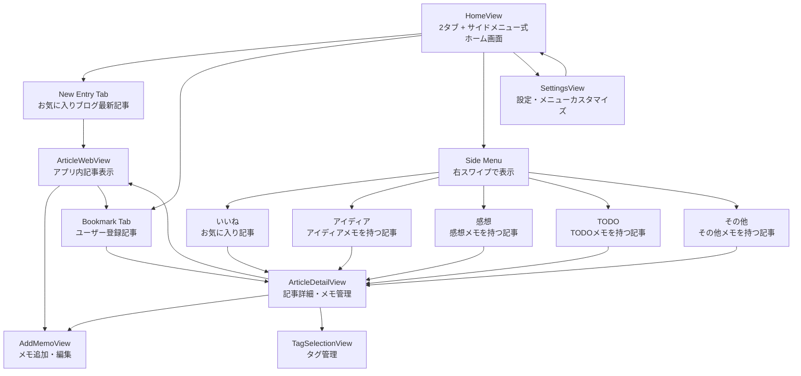

# Screen Design Document: Bookmark Manager (2タブ + サイドメニューシステム)

## Overview

UseCase.mdを基にした2タブ + サイドメニューシステムの詳細な画面設計ドキュメント。実際のデザイン制作とSwiftUI実装に使用する具体的な画面仕様を定義します。2タブ（New Entry, Bookmark）+ サイドメニュー（いいね、アイディア、感想、TODO、その他）、テキスト選択機能、スワイプ操作、動的メニュー表示に対応します。

---

## 🎨 デザインシステム

### カラーパレット

```
Primary Colors:
- App Blue: #007AFF (メインアクション)
- Background: #FFFFFF (ライトモード), #000000 (ダークモード)
- Card Background: #F9F9F9 (ライトモード), #1C1C1E (ダークモード)

Secondary Colors:
- Text Primary: #000000 (ライトモード), #FFFFFF (ダークモード)
- Text Secondary: #8E8E93
- Border: #E5E5EA (ライトモード), #38383A (ダークモード)
- Favorite Pink: #FF2D92

Memo Type Colors (2タブ + サイドメニューシステム対応):
- Idea Blue: #007AFF (アイディア)
- Thought Green: #34C759 (感想)
- Todo Orange: #FF9500 (TODO)
- Quote Purple: #AF52DE (引用)
- Other Gray: #8E8E93 (その他)
```

### タイポグラフィ

```
Font Family: SF Pro (iOS System Font)

Sizes:
- Large Title: 34pt, Bold (画面タイトル)
- Title 1: 28pt, Bold (セクションタイトル)
- Title 2: 22pt, Bold (カードタイトル)
- Title 3: 20pt, Semibold (サブタイトル)
- Body: 17pt, Regular (本文)
- Callout: 16pt, Regular (補足情報)
- Subheadline: 15pt, Regular (メタ情報)
- Footnote: 13pt, Regular (注釈)
- Caption: 12pt, Regular (キャプション)
```

### アイコンシステム (2タブ + サイドメニュー対応)

```
Tab Icons (SF Symbols):
- New Entry: newspaper.fill
- Bookmark: bookmark.fill

Side Menu Icons (SF Symbols):
- いいね: heart.fill
- アイディア: lightbulb.fill
- 感想: text.bubble.fill
- TODO: list.bullet
- その他: ellipsis.circle.fill

Action Icons (SF Symbols):
- 追加: plus.circle.fill
- 編集: pencil.circle.fill
- 削除: trash.fill
- 設定: gearshape.fill
- 検索: magnifyingglass
- 更新: arrow.clockwise
```

---

## 📱 詳細画面設計

### 1. HomeView (2タブ + サイドメニュー式ホーム画面)

**レイアウト構造:**

```
┌─────────────────────────────────────────────────────────┐
│                    [アプリアイコン]                      │ ← Header (44pt)
├─────────────────────────────────────────────────────────┤
│                                                         │
│  ┌──────────┐┌──────────┐                              │ ← 2タブセレクター (50pt)
│  │📰 New   ││📚 Book   │                              │   (スワイプ可能)
│  │  Entry  ││  mark    │                              │
│  └──────────┘└──────────┘                              │
│                                                         │
│  ┌─────────────────────────────────────────────────┐   │
│  │ [サムネイル]  📰 記事タイトル                    │   │ ← 記事カード
│  │ 60x60pt      example.com                        │   │   (高さ: 120pt)
│  │              🏷️ Tag1, Tag2                       │   │   (余白: 16pt)
│  │              ⏰ 2時間前  💬 3メモ  ❤️          │   │
│  └─────────────────────────────────────────────────┘   │
│                                                         │
│  ┌─────────────────────────────────────────────────┐   │
│  │ [サムネイル]  📰 記事タイトル                    │   │
│  │ 60x60pt      example.com                        │   │
│  │              🏷️ Tag3                             │   │
│  │              ⏰ 5時間前  💬 1メモ              │   │
│  └─────────────────────────────────────────────────┘   │
│                                                         │
│  [+ 新規記事追加ボタン]                                 │ ← Floating Button
└─────────────────────────────────────────────────────────┘
```

**コンポーネント詳細:**
- **Header**: 高さ44pt、中央にアプリアイコン（後日追加）
- **2タブセレクター**: 高さ50pt、横スクロール可能、選択タブは下線表示
- **記事カード**: 
  - 高さ120pt、Corner Radius 12pt、Shadow (opacity: 0.1, radius: 4pt)
  - サムネイル: 60x60pt、Corner Radius 8pt
  - タイトル: Title 2 (22pt, Bold)、最大2行
  - URL: Subheadline (15pt, Regular)、グレー
  - タグ: Footnote (13pt, Regular)、タグカラー
  - メタ情報: Caption (12pt, Regular)、グレー
- **Floating Button**: 右下、直径56pt、Shadow

**右スワイプ → サイドメニュー表示:**

```
┌─────────────────────────────────────────────────────────┐
│ ┌─────────────────┐                                     │
│ │ Side Menu       │                                     │ ← Menu Width: 280pt
│ │                 │                                     │   Animation: 0.3s
│ │ ❤️ いいね (5)   │                                     │
│ │ 💡 アイディア(3)│                                     │
│ │ 📝 感想 (2)     │                                     │
│ │ ✅ TODO (1)     │                                     │
│ │ ⋯ その他        │ ← メモ0件は非表示                   │
│ │                 │                                     │
│ │ ─────────────── │                                     │
│ │ ⚙️ 設定         │                                     │
│ └─────────────────┘                                     │
└─────────────────────────────────────────────────────────┘
```

**サイドメニュー詳細:**
- **幅**: 280pt
- **背景**: Card Background
- **アニメーション**: Spring (duration: 0.3s, dampingFraction: 0.8)
- **メニュー項目**: 高さ50pt、アイコン + テキスト + カウント
- **動的表示**: メモ0件の項目は自動非表示
- **閉じる**: 左スワイプ、メニュー外タップ

---

### 2. ArticleWebView (アプリ内記事表示)

**レイアウト構造:**

```
┌─────────────────────────────────────────────────────────┐
│ [←] 記事タイトル                          [⋯]           │ ← Navigation Bar
├─────────────────────────────────────────────────────────┤
│                                                         │
│  ┌─────────────────────────────────────────────────┐   │
│  │                                                 │   │
│  │         [ローディングインジケーター]             │   │ ← Loading State
│  │                                                 │   │
│  └─────────────────────────────────────────────────┘   │
│                                                         │
│  ┌─────────────────────────────────────────────────┐   │
│  │ 記事本文がここに表示されます                     │   │ ← WebView
│  │                                                 │   │
│  │ ユーザーがテキストを選択すると...               │   │
│  │                                                 │   │
│  │ [選択されたテキスト]                            │   │ ← Text Selection
│  │ ┌─────────────────────┐                         │   │
│  │ │ 引用メモを作成      │                         │   │
│  │ └─────────────────────┘                         │   │
│  │                                                 │   │
│  └─────────────────────────────────────────────────┘   │
│                                                         │
│                                    [📚 ブックマーク]    │ ← Floating Button
└─────────────────────────────────────────────────────────┘
```

**コンポーネント詳細:**
- **Navigation Bar**: 高さ44pt、戻るボタン、タイトル、メニューボタン
- **WebView**: WKWebView、フルスクリーン
- **テキスト選択**: 
  - 選択時にコンテキストメニュー表示
  - 「引用メモを作成」オプション
  - 選択テキストをハイライト表示
- **Floating Button**: 
  - スクロール停止時に表示（0.5秒後）
  - 右下、直径56pt、Shadow
  - タップでブックマーク登録

---

### 3. ArticleDetailView (記事詳細・メモ管理)

**レイアウト構造:**

```
┌─────────────────────────────────────────────────────────┐
│ [←] 記事詳細                              [⋯]           │ ← Navigation Bar
├─────────────────────────────────────────────────────────┤
│                                                         │
│  ┌─────────────────────────────────────────────────┐   │
│  │ [サムネイル]  📰 記事タイトル                    │   │ ← 記事情報カード
│  │ 80x80pt      example.com                        │   │   (高さ: 140pt)
│  │              🏷️ Tag1, Tag2                       │   │
│  │              ⏰ 2時間前  ❤️                      │   │
│  │              [WebViewで開く]                     │   │
│  └─────────────────────────────────────────────────┘   │
│                                                         │
│  メモ種類別一覧                                         │ ← Section Header
│  ┌─────────────────────────────────────────────────┐   │
│  │ 💡 アイディア (3)                    [+]        │   │ ← メモ種類カード
│  │ ┌─────────────────────────────────────────────┐ │   │   (展開可能)
│  │ │ メモ内容がここに表示されます...             │ │   │
│  │ │ 2時間前                                     │ │   │
│  │ └─────────────────────────────────────────────┘ │   │
│  │ ┌─────────────────────────────────────────────┐ │   │
│  │ │ 別のメモ内容...                             │ │   │
│  │ │ 5時間前                                     │ │   │
│  │ └─────────────────────────────────────────────┘ │   │
│  └─────────────────────────────────────────────────┘   │
│                                                         │
│  ┌─────────────────────────────────────────────────┐   │
│  │ 📝 感想 (2)                          [+]        │   │
│  └─────────────────────────────────────────────────┘   │
│                                                         │
│  ┌─────────────────────────────────────────────────┐   │
│  │ ✅ TODO (1)                          [+]        │   │
│  └─────────────────────────────────────────────────┘   │
│                                                         │
└─────────────────────────────────────────────────────────┘
```

**コンポーネント詳細:**
- **記事情報カード**: 
  - 高さ140pt、Corner Radius 12pt
  - サムネイル: 80x80pt
  - お気に入りボタン: 右上、タップでトグル
  - WebViewボタン: 下部、全幅
- **メモ種類カード**: 
  - 高さ可変、Corner Radius 12pt
  - ヘッダー: メモ種類アイコン + 名前 + カウント + 追加ボタン
  - 展開/折りたたみ可能
  - メモ一覧: 時系列順、スワイプで削除
- **メモアイテム**: 
  - 高さ可変、最小60pt
  - 内容: Body (17pt)、最大3行
  - 日時: Caption (12pt)、グレー

---

### 4. AddMemoView (メモ追加・編集)

**レイアウト構造:**

```
┌─────────────────────────────────────────────────────────┐
│ [キャンセル] メモ追加                    [保存]         │ ← Navigation Bar
├─────────────────────────────────────────────────────────┤
│                                                         │
│  メモ種類                                               │ ← Section Header
│  ┌─────────────────────────────────────────────────┐   │
│  │ 💡 アイディア                        [▼]        │   │ ← Picker
│  └─────────────────────────────────────────────────┘   │
│                                                         │
│  メモ内容                                               │
│  ┌─────────────────────────────────────────────────┐   │
│  │                                                 │   │
│  │ ここにメモを入力...                             │   │ ← TextEditor
│  │                                                 │   │   (高さ: 200pt)
│  │                                                 │   │
│  │                                                 │   │
│  └─────────────────────────────────────────────────┘   │
│  0/140                                                  │ ← 文字数カウンター
│                                                         │
│  引用元 (引用メモの場合)                                │
│  ┌─────────────────────────────────────────────────┐   │
│  │ "選択されたテキストがここに表示されます..."     │   │ ← Quote Preview
│  │ https://example.com/article                     │   │
│  └─────────────────────────────────────────────────┘   │
│                                                         │
└─────────────────────────────────────────────────────────┘
```

**コンポーネント詳細:**
- **メモ種類Picker**: 
  - 高さ50pt、Corner Radius 8pt
  - メモ種類アイコン + 名前
  - タップでピッカー表示
- **TextEditor**: 
  - 高さ200pt、Corner Radius 8pt
  - プレースホルダー: 「ここにメモを入力...」
  - リアルタイム文字数カウント
- **文字数カウンター**: 
  - Caption (12pt)、右寄せ
  - 140文字超過時は赤色表示
- **引用プレビュー**: 
  - 高さ可変、Corner Radius 8pt
  - 背景: 薄いグレー
  - 引用テキスト: イタリック
  - URL: Footnote (13pt)、青色

---

### 5. TagSelectionView (タグ管理)

**レイアウト構造:**

```
┌─────────────────────────────────────────────────────────┐
│ [キャンセル] タグ選択                    [完了]         │ ← Navigation Bar
├─────────────────────────────────────────────────────────┤
│                                                         │
│  ┌─────────────────────────────────────────────────┐   │
│  │ 🔍 タグを検索または追加...                      │   │ ← Search Bar
│  └─────────────────────────────────────────────────┘   │
│                                                         │
│  よく使うタグ                                           │ ← Section Header
│  ┌───┐┌───┐┌───┐┌───┐┌───┐                           │
│  │Tag││Tag││Tag││Tag││Tag│                           │ ← Tag Chips
│  │ 1 ││ 2 ││ 3 ││ 4 ││ 5 │                           │   (横スクロール)
│  └───┘└───┘└───┘└───┘└───┘                           │
│                                                         │
│  すべてのタグ (使用頻度順)                              │
│  ┌─────────────────────────────────────────────────┐   │
│  │ 🏷️ Tag1                              [✓]        │   │ ← Tag List Item
│  └─────────────────────────────────────────────────┘   │   (高さ: 50pt)
│  ┌─────────────────────────────────────────────────┐   │
│  │ 🏷️ Tag2                              [ ]        │   │
│  └─────────────────────────────────────────────────┘   │
│  ┌─────────────────────────────────────────────────┐   │
│  │ 🏷️ Tag3                              [✓]        │   │
│  └─────────────────────────────────────────────────┘   │
│                                                         │
└─────────────────────────────────────────────────────────┘
```

**コンポーネント詳細:**
- **Search Bar**: 
  - 高さ44pt、Corner Radius 10pt
  - プレースホルダー: 「タグを検索または追加...」
  - リアルタイム検索
- **Tag Chips**: 
  - 高さ32pt、Corner Radius 16pt
  - 背景: タグカラー（薄い）
  - テキスト: Footnote (13pt)
  - タップで選択/解除
- **Tag List Item**: 
  - 高さ50pt
  - アイコン + タグ名 + チェックマーク
  - スワイプで削除、長押しで編集

---

### 6. SettingsView (設定・メニューカスタマイズ)

**レイアウト構造:**

```
┌─────────────────────────────────────────────────────────┐
│ [←] 設定                                                │ ← Navigation Bar
├─────────────────────────────────────────────────────────┤
│                                                         │
│  サイドメニュー設定                                     │ ← Section Header
│  ┌─────────────────────────────────────────────────┐   │
│  │ スワイプ操作を有効にする              [ON]      │   │ ← Toggle
│  └─────────────────────────────────────────────────┘   │
│                                                         │
│  メニュー項目の順序                                     │
│  ┌─────────────────────────────────────────────────┐   │
│  │ ≡ ❤️ いいね                          [👁️]      │   │ ← Reorderable List
│  └─────────────────────────────────────────────────┘   │   (ドラッグ可能)
│  ┌─────────────────────────────────────────────────┐   │
│  │ ≡ 💡 アイディア                      [👁️]      │   │
│  └─────────────────────────────────────────────────┘   │
│  ┌─────────────────────────────────────────────────┐   │
│  │ ≡ 📝 感想                            [👁️]      │   │
│  └─────────────────────────────────────────────────┘   │
│  ┌─────────────────────────────────────────────────┐   │
│  │ ≡ ✅ TODO                            [👁️]      │   │
│  └─────────────────────────────────────────────────┘   │
│  ┌─────────────────────────────────────────────────┐   │
│  │ ≡ ⋯ その他                          [👁️]      │   │
│  └─────────────────────────────────────────────────┘   │
│                                                         │
│  [デフォルトに戻す]                                     │ ← Button
│                                                         │
└─────────────────────────────────────────────────────────┘
```

**コンポーネント詳細:**
- **Toggle**: 
  - 高さ50pt
  - ラベル + スイッチ
- **Reorderable List Item**: 
  - 高さ50pt
  - ドラッグハンドル (≡) + アイコン + 名前 + 表示/非表示トグル
  - ドラッグ&ドロップで順序変更
- **デフォルトに戻すボタン**: 
  - 高さ50pt、Corner Radius 8pt
  - 背景: 赤色（薄い）
  - タップで確認ダイアログ表示

---

## 🔄 詳細画面遷移図（2タブ + サイドメニューシステム対応）



---

## 📐 レスポンシブ対応（2タブ + サイドメニューシステム）

### iPhone画面サイズ対応

```
iPhone SE (375pt width):
- 2タブ: 全表示可能
- タブ幅: 187pt (均等分割)
- サイドメニュー幅: 280pt (画面の75%)
- 余白: 16pt

iPhone Pro (393pt width):
- 2タブ: 全表示可能
- タブ幅: 196pt (均等分割)
- サイドメニュー幅: 280pt
- 余白: 20pt

iPhone Pro Max (430pt width):
- 2タブ: 全表示可能
- タブ幅: 215pt (均等分割)
- サイドメニュー幅: 300pt
- 余白: 24pt
```

### ダークモード対応

```
自動切り替え:
- システム設定に従う
- カラーパレットを自動調整
- コントラスト比を維持 (WCAG AA準拠)

カスタムカラー:
- Background: #000000
- Card Background: #1C1C1E
- Border: #38383A
- Text Primary: #FFFFFF
- メモ種類カラーは明度調整
```

---

## 🎯 インタラクション詳細（2タブ + サイドメニューシステム対応）

### 2タブ切り替え

```
State: Normal → Active → Inactive

Normal:
- 背景: 透明
- テキスト: グレー
- 下線: なし

Active:
- 背景: 透明
- テキスト: App Blue
- 下線: App Blue (高さ2pt)

Inactive:
- 背景: 透明
- テキスト: グレー
- 下線: なし

Animation: Spring (duration: 0.3s)
```

### サイドメニュー開閉

```
Open (右スワイプ):
1. スワイプ開始 (translation > 0)
2. メニューが追従 (translation * 0.8)
3. スワイプ終了 (translation > 100pt)
4. メニューが完全に開く (280pt)
5. 背景にオーバーレイ表示 (opacity: 0.3)

Close (左スワイプ / メニュー外タップ):
1. スワイプ開始 or タップ
2. メニューが閉じる (0pt)
3. オーバーレイが消える (opacity: 0)

Animation: Spring (duration: 0.3s, dampingFraction: 0.8)
```

### カードスワイプアクション

```
Left Swipe:
1. スワイプ開始 (translation < 0)
2. アクションボタンが表示される
3. スワイプ終了 (translation < -80pt)
4. アクションボタンが固定表示

Actions:
- 削除 (赤): 左端
- お気に入り (ピンク): 中央
- 編集 (青): 右端

Button Size: 80pt x 120pt
Animation: Linear (duration: 0.2s)
```

### テキスト選択

```
Selection:
1. ユーザーがテキストを長押し
2. 選択ハンドルが表示される
3. ユーザーがハンドルをドラッグ
4. 選択範囲が拡大/縮小
5. コンテキストメニューが表示される

Context Menu:
- コピー
- 引用メモを作成 ← カスタムアクション
- 共有

Animation: Fade In (duration: 0.2s)
```

---

## 🎨 アニメーション仕様

### 画面遷移

```
Push/Pop:
- Duration: 0.35s
- Curve: easeInOut
- Transform: translateX (100%)

Modal Present/Dismiss:
- Duration: 0.3s
- Curve: easeOut
- Transform: translateY (100%)

Fade In/Out:
- Duration: 0.2s
- Curve: linear
- Opacity: 0 → 1 / 1 → 0
```

### マイクロインタラクション

```
Button Tap:
- Scale: 1.0 → 0.95 → 1.0
- Duration: 0.1s
- Curve: easeInOut

Card Tap:
- Scale: 1.0 → 0.98 → 1.0
- Duration: 0.15s
- Curve: easeInOut

Toggle Switch:
- Duration: 0.3s
- Curve: spring
- Haptic Feedback: light

Loading Indicator:
- Rotation: 0° → 360° (continuous)
- Duration: 1.0s
- Curve: linear
```

---

このScreen Design Documentにより、2タブ + サイドメニューシステムの具体的なビジュアルデザインと実装仕様が完全に定義されました。デザイナーは正確なUI設計を作成でき、開発者は一貫性のあるユーザー体験を実装できます。
