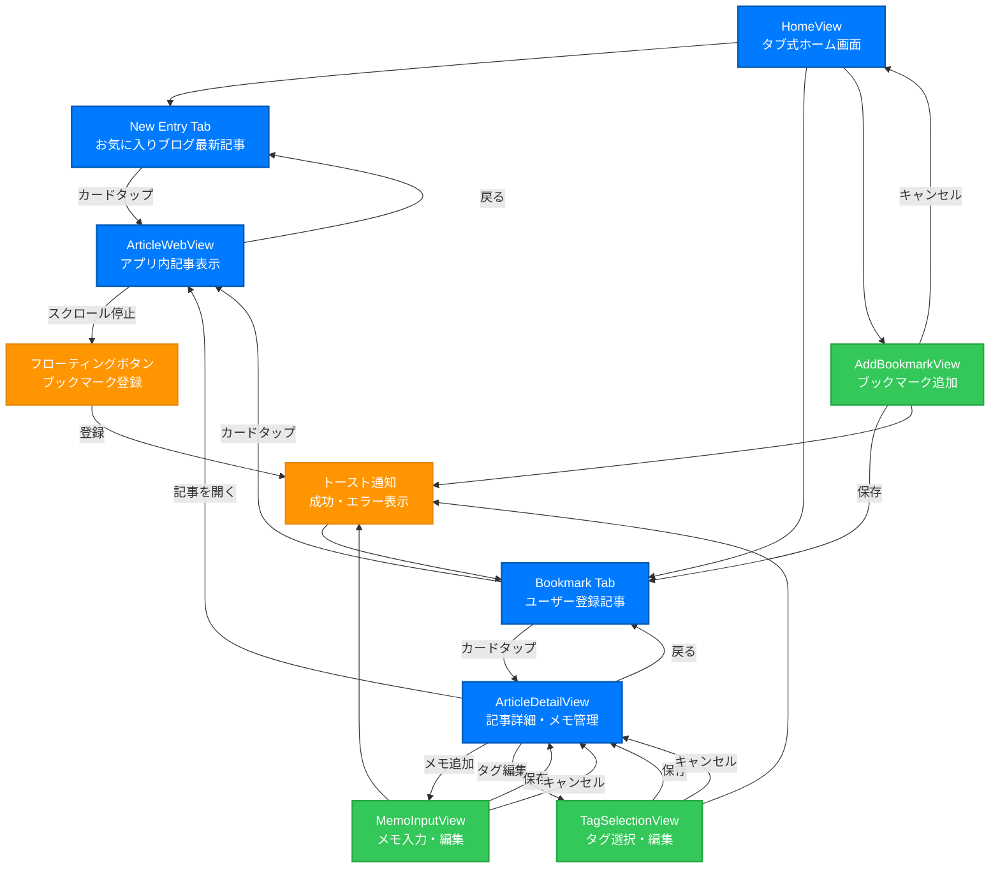
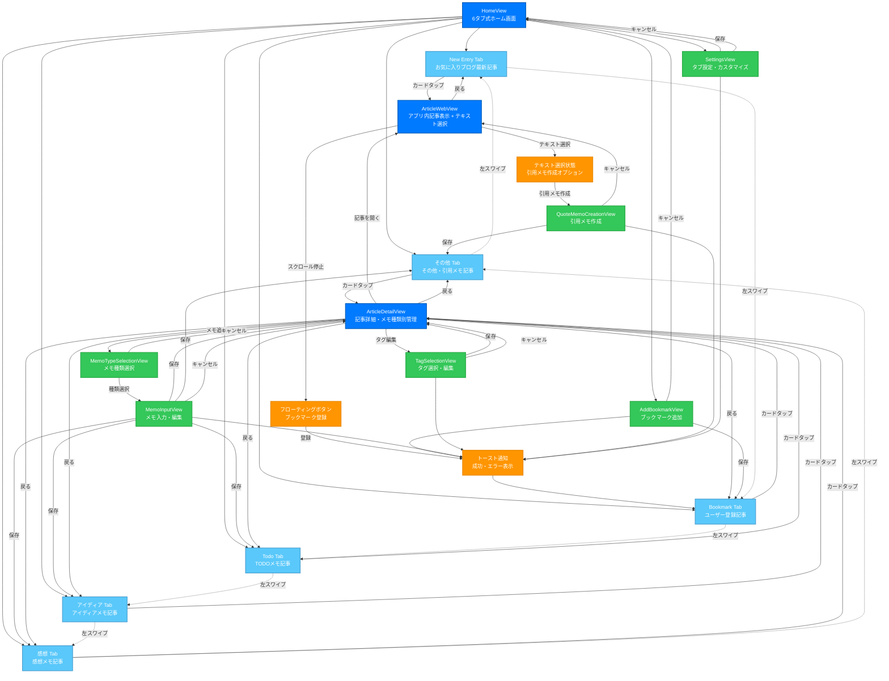

# Screen Design Document: Bookmark Manager (6タブシステム)

## Overview

UseCase.mdを基にした6タブシステムの詳細な画面設計ドキュメント。実際のデザイン制作とSwiftUI実装に使用する具体的な画面仕様を定義します。6タブ（New Entry, Bookmark, Todo, アイディア, 感想, その他）、テキスト選択機能、スワイプ操作、動的タブ表示に対応します。

---

## 🎨 デザインシステム

### カラーパレット
```
Primary Colors:
- Primary Blue: #007AFF (iOS標準ブルー)
- Secondary Gray: #8E8E93
- Background: #F2F2F7 (iOS標準背景)
- Card Background: #FFFFFF

Status Colors:
- Success Green: #34C759
- Warning Orange: #FF9500
- Error Red: #FF3B30
- Favorite Pink: #FF2D92

Memo Type Colors (6タブシステム対応):
- Idea Blue: #007AFF (アイディア)
- Thought Green: #34C759 (感想)
- Todo Orange: #FF9500 (TODO)
- Quote Purple: #AF52DE (引用)
- Other Gray: #8E8E93 (その他)
- New Entry Teal: #5AC8FA (New Entry)
- Bookmark Gold: #FFCC02 (Bookmark)

Text Colors:
- Primary Text: #000000
- Secondary Text: #3C3C43
- Tertiary Text: #8E8E93
```

### タイポグラフィ
```
- Large Title: 34pt, Bold
- Title 1: 28pt, Regular
- Title 2: 22pt, Regular
- Title 3: 20pt, Regular
- Headline: 17pt, Semibold
- Body: 17pt, Regular
- Callout: 16pt, Regular
- Subhead: 15pt, Regular
- Footnote: 13pt, Regular
- Caption 1: 12pt, Regular
- Caption 2: 11pt, Regular
```

### スペーシング
```
- XXS: 4pt
- XS: 8pt
- S: 12pt
- M: 16pt
- L: 20pt
- XL: 24pt
- XXL: 32pt
```

### アイコンシステム (6タブ対応)
```
Tab Icons (SF Symbols):
- New Entry: newspaper.fill
- Bookmark: bookmark.fill
- Todo: list.bullet
- アイディア: lightbulb.fill
- 感想: heart.fill
- その他: ellipsis.circle.fill

Memo Type Icons:
- アイディア: lightbulb (Blue)
- 感想: heart (Green)
- TODO: list.bullet (Orange)
- 引用: quote.bubble (Purple)
- その他: ellipsis (Gray)
```
- M: 16pt
- L: 20pt
- XL: 24pt
- XXL: 32pt
```

---

## 📱 詳細画面設計

### 1. HomeView (6タブ式ホーム画面)

```
┌─────────────────────────────────────────────────────────┐
│ ●●●                                              📶 🔋 │ ← ステータスバー
├─────────────────────────────────────────────────────────┤
│                                                         │
│  📚 KiroBookmark                            ⚙️    ➕   │ ← ヘッダー (Large Title + 設定 + 追加)
│                                                         │
├─────────────────────────────────────────────────────────┤
│                                                         │
│  ┌──┐┌──────┐┌────┐┌──────┐┌────┐┌────┐              │ ← 6タブセレクター
│  │📰││ 📚 ││💡││ ❤️ ││📝││⋯││              │   (スワイプ可能)
│  │New││Book││Idea││感想││Todo││他││              │
│  │━━││    ││    ││    ││    ││  ││              │ ← アクティブタブ下線
│  └──┘└──────┘└────┘└──────┘└────┘└────┘              │
│                                                         │
├─────────────────────────────────────────────────────────┤
│                                                         │
│  ┌─────────────────────────────────────────────────┐   │ ← 記事カード
│  │ 📰                                          ♡   │   │
│  │ SwiftUIで始める宣言的UI開発                      │   │ ← タイトル (Headline)
│  │                                                 │   │
│  │ 📍 qiita.com                    ⏰ 2時間前      │   │ ← ドメイン + 時間 (Caption)
│  │                                                 │   │
│  │ SwiftUIの基本的な使い方から応用まで...           │   │ ← 概要 (Body)
│  │                                                 │   │
│  │ 🏷️ Swift  iOS  Tutorial                        │   │ ← タグ (Caption)
│  │ 💡 2件  ❤️ 1件  📝 1件                          │   │ ← メモ種類別カウント
│  └─────────────────────────────────────────────────┘   │
│                                                         │
│  ┌─────────────────────────────────────────────────┐   │
│  │ 📰                                          ♡   │   │
│  │ React Hooksの効果的な使い方                      │   │
│  │                                                 │   │
│  │ 📍 zenn.dev                     ⏰ 5時間前      │   │
│  │                                                 │   │
│  │ useState, useEffectの実践的な活用方法...         │   │
│  │                                                 │   │
│  │ 🏷️ React  JavaScript  Frontend                 │   │
│  │ ❤️ 3件  📝 2件                                  │   │ ← メモ種類別カウント
│  └─────────────────────────────────────────────────┘   │
│                                                         │
│  ┌─────────────────────────────────────────────────┐   │
│  │ 📰                                          ♡   │   │
│  │ 機械学習モデルの本番運用ベストプラクティス          │   │
│  │                                                 │   │
│  │ 📍 medium.com                   ⏰ 1日前        │   │
│  │                                                 │   │
│  │ MLOpsの観点から見た運用のポイント...             │   │
│  │                                                 │   │
│  │ 🏷️ MachineLearning  MLOps  Python              │   │
│  │ 💡 1件  📝 2件  💬 1件                          │   │ ← メモ種類別カウント
│  └─────────────────────────────────────────────────┘   │
│                                                         │
└─────────────────────────────────────────────────────────┘
```

**コンポーネント詳細:**
- **6タブセレクター**: Custom Horizontal ScrollView, 動的表示/非表示
- **タブアイコン**: SF Symbol + メモ種類別カラー
- **記事カード**: VStack + HStack, Corner Radius 12pt, Shadow
- **メモ種類別カウント**: HStack of Capsules with Icons
- **スワイプジェスチャー**: DragGesture for Tab Switching
- **お気に入りボタン**: SF Symbol "heart" / "heart.fill"

---

### 2. ArticleWebView (テキスト選択対応アプリ内記事表示)

```
┌─────────────────────────────────────────────────────────┐
│ ●●●                                              📶 🔋 │
├─────────────────────────────────────────────────────────┤
│                                                         │
│  ← SwiftUIで始める宣言的UI開発                    ⋯    │ ← ナビゲーションバー
│                                                         │
├─────────────────────────────────────────────────────────┤
│ ┌─────────────────────────────────────────────────────┐ │
│ │                                                     │ │
│ │  ┌─ WebView Content ──────────────────────────┐   │ │ ← 記事コンテンツ
│ │  │                                             │   │ │
│ │  │ # SwiftUIで始める宣言的UI開発                │   │ │
│ │  │                                             │   │ │
│ │  │ SwiftUIは、Appleが開発した宣言的なUI        │   │ │
│ │  │ フレームワークです...                        │   │ │
│ │  │                                             │   │ │
│ │  │ ████████████████████████████████████████    │   │ │ ← テキスト選択
│ │  │ █ この部分が重要なポイントです。実装時に █    │   │ │   (ハイライト表示)
│ │  │ █ 注意すべき点を詳しく説明します。   █    │   │ │   #AF52DE (Purple)
│ │  │ ████████████████████████████████████████    │   │ │
│ │  │                                             │   │ │
│ │  │ ## 基本的な使い方                           │   │ │
│ │  │                                             │   │ │
│ │  │ ```swift                                    │   │ │
│ │  │ struct ContentView: View {                  │   │ │
│ │  │     var body: some View {                   │   │ │
│ │  │         Text("Hello, World!")              │   │ │
│ │  │     }                                       │   │ │
│ │  │ }                                           │   │ │
│ │  │ ```                                         │   │ │
│ │  │                                             │   │ │
│ │  └─────────────────────────────────────────────┘   │ │
│ └─────────────────────────────────────────────────────┘ │
│                                                         │
│                    ┌─────────────────┐                  │ ← テキスト選択時表示
│                    │ 💬 引用メモを作成 │                  │   (選択時のみ表示)
│                    └─────────────────┘                  │
│                                                         │
│                    ┌─────────────────┐                  │ ← フローティングボタン
│                    │ 📚 ブックマーク登録 │                  │   (スクロール停止時表示)
│                    └─────────────────┘                  │
│                                                         │
└─────────────────────────────────────────────────────────┘
```

**コンポーネント詳細:**
- **WebView**: WKWebView + SwiftUI Integration + Text Selection Support
- **テキスト選択**: Custom Selection Overlay with Purple Highlight
- **引用メモボタン**: Conditional Display on Text Selection
- **フローティングボタン**: Capsule + Shadow, Animation on Scroll Stop
- **ナビゲーション**: Back Button + Title + More Menu

---

### 3. MemoTypeSelectionView (メモ種類選択画面)

```
┌─────────────────────────────────────────────────────────┐
│ ●●●                                              📶 🔋 │
├─────────────────────────────────────────────────────────┤
│                                                         │
│  ✕ メモ種類を選択                              次へ   │ ← ナビゲーションバー
│                                                         │
├─────────────────────────────────────────────────────────┤
│                                                         │
│  💭 メモの種類を選択してください                          │ ← セクションヘッダー
│                                                         │
│  ┌─────────────────────────────────────────────────┐   │ ← メモ種類選択
│  │                                                 │   │
│  │ ○ 💡 アイディア                                 │   │ ← ラジオボタン
│  │   新しいアイディアや発想を記録                    │   │   + 説明文
│  │                                                 │   │
│  │ ● ❤️ 感想                                      │   │ ← 選択済み
│  │   記事を読んだ感想や意見を記録                    │   │
│  │                                                 │   │
│  │ ○ 📝 TODO                                      │   │
│  │   やるべきことや課題を記録                       │   │
│  │                                                 │   │
│  │ ○ 💬 引用                                      │   │
│  │   重要な部分の引用を記録                         │   │
│  │                                                 │   │
│  │ ○ ⋯ その他                                     │   │
│  │   上記以外のメモを記録                           │   │
│  │                                                 │   │
│  └─────────────────────────────────────────────────┘   │
│                                                         │
│                                                         │
│                    ┌─────────────────┐                  │ ← 次へボタン
│                    │   次へ →        │                  │
│                    └─────────────────┘                  │
│                                                         │
└─────────────────────────────────────────────────────────┘
```

**コンポーネント詳細:**
- **メモ種類選択**: Custom Radio Button Group with Icons
- **説明文**: Each memo type has descriptive text
- **選択状態**: Color + Icon + Border Highlight
- **次へボタン**: Enabled only when selection is made

---

### 4. QuoteMemoCreationView (引用メモ作成画面)

```
┌─────────────────────────────────────────────────────────┐
│ ●●●                                              📶 🔋 │
├─────────────────────────────────────────────────────────┤
│                                                         │
│  ✕ 引用メモを作成                              保存   │ ← ナビゲーションバー
│                                                         │
├─────────────────────────────────────────────────────────┤
│                                                         │
│  💬 選択されたテキスト                                  │ ← セクションヘッダー
│                                                         │
│  ┌─────────────────────────────────────────────────┐   │ ← 引用テキスト表示
│  │ "この部分が重要なポイントです。実装時に注意すべき   │   │   (読み取り専用)
│  │ 点を詳しく説明します。"                           │   │
│  │                                                 │   │
│  │ 📍 出典: https://qiita.com/example/swiftui      │   │ ← 引用元URL
│  │ ⏰ 選択日時: 2024-12-23 14:30                   │   │ ← 選択日時
│  └─────────────────────────────────────────────────┘   │
│                                                         │
│  ✏️ 追加コメント（任意）                                │ ← 追加コメント
│                                                         │
│  ┌─────────────────────────────────────────────────┐   │ ← テキスト入力
│  │ この引用について思ったことや関連するアイディアを   │   │
│  │ 記録できます...                                 │   │
│  │                                                 │   │
│  │                                                 │   │
│  │                                                 │   │
│  └─────────────────────────────────────────────────┘   │
│                                                         │
│  98/140文字                                            │ ← 文字数カウンター
│                                                         │
│                                                         │
│                    ┌─────────────────┐                  │ ← 保存ボタン
│                    │   💾 保存する    │                  │
│                    └─────────────────┘                  │
│                                                         │
└─────────────────────────────────────────────────────────┘
```

**コンポーネント詳細:**
- **引用テキスト**: Read-only Text with Quote Styling
- **引用元情報**: URL + Selection Timestamp
- **追加コメント**: TextEditor with Character Limit
- **文字数カウンター**: Real-time Update + Color Change
- **保存ボタン**: Validation-based Enable/Disable

---

### 5. SettingsView (タブ設定・カスタマイズ画面)

```
┌─────────────────────────────────────────────────────────┐
│ ●●●                                              📶 🔋 │
├─────────────────────────────────────────────────────────┤
│                                                         │
│  ← 設定                                        保存   │ ← ナビゲーションバー
│                                                         │
├─────────────────────────────────────────────────────────┤
│                                                         │
│  🏷️ タブ設定                                           │ ← セクションヘッダー
│                                                         │
│  ┌─────────────────────────────────────────────────┐   │ ← タブ順序設定
│  │ タブの順序（ドラッグで並び替え）                     │   │
│  │                                                 │   │
│  │ ≡ 📰 New Entry                          ☑️     │   │ ← ドラッグハンドル
│  │ ≡ 📚 Bookmark                           ☑️     │   │   + 表示チェック
│  │ ≡ 💡 アイディア                          ☑️     │   │
│  │ ≡ ❤️ 感想                               ☑️     │   │
│  │ ≡ 📝 TODO                               ☑️     │   │
│  │ ≡ ⋯ その他                              ☑️     │   │
│  │                                                 │   │
│  └─────────────────────────────────────────────────┘   │
│                                                         │
│  ⚙️ 動作設定                                           │ ← セクションヘッダー
│                                                         │
│  ┌─────────────────────────────────────────────────┐   │ ← 動作設定
│  │                                                 │   │
│  │ スワイプでタブ切り替え              🔘 ON      │   │ ← トグルスイッチ
│  │                                                 │   │
│  │ 空のタブを自動非表示                🔘 ON      │   │
│  │                                                 │   │
│  │ タブ切り替えアニメーション          🔘 ON      │   │
│  │                                                 │   │
│  └─────────────────────────────────────────────────┘   │
│                                                         │
│                    ┌─────────────────┐                  │ ← リセットボタン
│                    │ 🔄 デフォルトに戻す │                  │
│                    └─────────────────┘                  │
│                                                         │
└─────────────────────────────────────────────────────────┘
```

**コンポーネント詳細:**
- **タブ順序**: Drag & Drop Reordering with Handle Icons
- **表示チェック**: Toggle for Tab Visibility (New Entry/Bookmark always visible)
- **動作設定**: Toggle Switches for Behavior Settings
- **リセットボタン**: Restore Default Configuration

---

### 3. ArticleDetailView (記事詳細・メモ管理)

```
┌─────────────────────────────────────────────────────────┐
│ ●●●                                              📶 🔋 │
├─────────────────────────────────────────────────────────┤
│                                                         │
│  ← 記事詳細                                      ⋯    │
│                                                         │
├─────────────────────────────────────────────────────────┤
│                                                         │
│  ┌─────────────────────────────────────────────────┐   │ ← 記事情報カード
│  │ 📰 SwiftUIで始める宣言的UI開発              ♡   │   │
│  │                                                 │   │
│  │ 🔗 https://qiita.com/example/swiftui-guide     │   │
│  │                                                 │   │
│  │ 📅 2024-12-23 10:30 に登録                     │   │
│  │                                                 │   │
│  │ 🏷️ Swift  iOS  Tutorial              ✏️ 編集  │   │ ← タグ + 編集ボタン
│  └─────────────────────────────────────────────────┘   │
│                                                         │
│  ┌─────────────────────────────────────────────────┐   │ ← メモセクション
│  │ 💭 メモ (3件)                            ➕ 追加 │   │
│  └─────────────────────────────────────────────────┘   │
│                                                         │
│  ┌─────────────────────────────────────────────────┐   │ ← メモアイテム
│  │ 💡 アイディア                          2時間前   │   │
│  │                                                 │   │
│  │ この記事のアプローチが参考になる。実際のプロジェ   │   │
│  │ クトで試してみたい。                             │   │
│  │                                                 │   │
│  │                                          ⋯     │   │ ← メニューボタン
│  └─────────────────────────────────────────────────┘   │
│                                                         │
│  ┌─────────────────────────────────────────────────┐   │
│  │ 📝 感想                                1日前     │   │
│  │                                                 │   │
│  │ SwiftUIの宣言的な書き方に慣れるまで時間がかかっ   │   │
│  │ たが、慣れると直感的で書きやすい。                │   │
│  │                                                 │   │
│  │                                          ⋯     │   │
│  └─────────────────────────────────────────────────┘   │
│                                                         │
│  ┌─────────────────────────────────────────────────┐   │
│  │ 📋 TODO                               3日前      │   │
│  │                                                 │   │
│  │ サンプルコードを実際に動かしてみる                │   │
│  │                                                 │   │
│  │                                          ⋯     │   │
│  └─────────────────────────────────────────────────┘   │
│                                                         │
│                                                         │
│                    ┌─────────────────┐                  │ ← アクションボタン
│                    │   📖 記事を開く   │                  │
│                    └─────────────────┘                  │
│                                                         │
└─────────────────────────────────────────────────────────┘
```

**コンポーネント詳細:**
- **記事情報カード**: VStack, Rounded Rectangle
- **メモアイテム**: HStack + VStack, Swipe Actions
- **メモタイプアイコン**: SF Symbols (lightbulb, pencil, list.bullet)
- **アクションボタン**: Prominent Button Style

---

### 4. AddBookmarkView (ブックマーク追加)

```
┌─────────────────────────────────────────────────────────┐
│ ●●●                                              📶 🔋 │
├─────────────────────────────────────────────────────────┤
│                                                         │
│  ✕ ブックマーク追加                              保存   │ ← ナビゲーションバー
│                                                         │
├─────────────────────────────────────────────────────────┤
│                                                         │
│                                                         │
│  🔗 URL                                                 │ ← セクションヘッダー
│                                                         │
│  ┌─────────────────────────────────────────────────┐   │ ← URL入力フィールド
│  │ https://                                        │   │
│  │                                                 │   │
│  └─────────────────────────────────────────────────┘   │
│                                                         │
│  ✅ 有効なURLです                                       │ ← バリデーション表示
│                                                         │
│                                                         │
│  📰 プレビュー                                          │ ← プレビューセクション
│                                                         │
│  ┌─────────────────────────────────────────────────┐   │ ← プレビューカード
│  │ 🔄 メタデータを取得中...                         │   │
│  │                                                 │   │
│  │ ┌─────────────────────────────────────────────┐ │   │
│  │ │                                             │ │   │
│  │ │ SwiftUIで始める宣言的UI開発                  │ │   │ ← 取得されたタイトル
│  │ │                                             │ │   │
│  │ │ 📍 qiita.com                               │ │   │ ← ドメイン
│  │ │                                             │ │   │
│  │ │ SwiftUIの基本的な使い方から応用まで詳しく   │ │   │ ← 概要
│  │ │ 解説します...                               │ │   │
│  │ │                                             │ │   │
│  │ └─────────────────────────────────────────────┘ │   │
│  └─────────────────────────────────────────────────┘   │
│                                                         │
│                                                         │
│                                                         │
│                                                         │
│                    ┌─────────────────┐                  │ ← 追加ボタン
│                    │   📚 追加する    │                  │
│                    └─────────────────┘                  │
│                                                         │
└─────────────────────────────────────────────────────────┘
```

**コンポーネント詳細:**
- **URL入力**: TextField + Custom Style
- **バリデーション**: Text + Color Coding
- **プレビューカード**: Async Loading + Placeholder
- **追加ボタン**: Disabled State Management

---

### 5. TagSelectionView (タグ選択・編集)

```
┌─────────────────────────────────────────────────────────┐
│ ●●●                                              📶 🔋 │
├─────────────────────────────────────────────────────────┤
│                                                         │
│  ✕ タグ編集                                      保存   │
│                                                         │
├─────────────────────────────────────────────────────────┤
│                                                         │
│  🏷️ 既存タグ                                           │ ← セクションヘッダー
│                                                         │
│  ┌─────────────────────────────────────────────────┐   │ ← タグ選択エリア
│  │                                                 │   │
│  │ ☑️ Swift (15)    ☑️ iOS (12)    ☐ React (8)   │   │ ← タグチップ
│  │                                                 │   │   (選択済み/未選択)
│  │ ☐ Python (5)    ☑️ Tutorial (20) ☐ AI (3)     │   │
│  │                                                 │   │
│  │ ☐ Web (7)       ☐ Backend (4)   ☐ Frontend (6) │   │
│  │                                                 │   │
│  └─────────────────────────────────────────────────┘   │
│                                                         │
│                                                         │
│  ➕ 新しいタグ                                          │ ← 新規タグセクション
│                                                         │
│  ┌─────────────────────────────────────────────────┐   │ ← 新規タグ入力
│  │ タグ名を入力...                                  │   │
│  │                                                 │   │
│  └─────────────────────────────────────────────────┘   │
│                                                         │
│                                                         │
│  💡 よく使われるタグ                                    │ ← 推奨タグセクション
│                                                         │
│  ┌─────────────────────────────────────────────────┐   │
│  │                                                 │   │
│  │ [Machine Learning] [Tutorial] [Best Practice]  │   │ ← 推奨タグチップ
│  │                                                 │   │
│  │ [Backend] [Frontend] [Mobile] [Web Development] │   │
│  │                                                 │   │
│  └─────────────────────────────────────────────────┘   │
│                                                         │
│                                                         │
└─────────────────────────────────────────────────────────┘
```

**コンポーネント詳細:**
- **タグチップ**: Capsule + Checkmark + Usage Count
- **選択状態**: Color + Border + Checkmark Icon
- **新規入力**: TextField + Real-time Validation
- **推奨タグ**: Tappable Chips + Auto-add

---

### 6. MemoInputView (メモ入力画面)

```
┌─────────────────────────────────────────────────────────┐
│ ●●●                                              📶 🔋 │
├─────────────────────────────────────────────────────────┤
│                                                         │
│  ✕ メモを追加                                    保存   │
│                                                         │
├─────────────────────────────────────────────────────────┤
│                                                         │
│  💭 メモタイプ                                          │ ← メモタイプ選択
│                                                         │
│  ┌─────────────────────────────────────────────────┐   │
│  │ ● 💡 アイディア  ○ 📝 感想  ○ 📋 TODO  ○ 💬 その他 │   │ ← ラジオボタン
│  └─────────────────────────────────────────────────┘   │
│                                                         │
│                                                         │
│  ✏️ 内容                                               │ ← 入力エリア
│                                                         │
│  ┌─────────────────────────────────────────────────┐   │ ← テキスト入力
│  │ この記事のアプローチが参考になる。実際のプロジェク   │   │
│  │ トで試してみたい。SwiftUIの宣言的な書き方に慣れる   │   │
│  │ まで時間がかかったが、慣れると直感的で書きやすい。   │   │
│  │                                                 │   │
│  │                                                 │   │
│  │                                                 │   │
│  │                                                 │   │
│  │                                                 │   │
│  │                                                 │   │
│  └─────────────────────────────────────────────────┘   │
│                                                         │
│  127/140文字                                           │ ← 文字数カウンター
│                                                         │
│                                                         │
│                                                         │
│                    ┌─────────────────┐                  │ ← 保存ボタン
│                    │   💾 保存する    │                  │
│                    └─────────────────┘                  │
│                                                         │
└─────────────────────────────────────────────────────────┘
```

**コンポーネント詳細:**
- **メモタイプ**: Custom Radio Button Group
- **テキスト入力**: TextEditor + Character Limit
- **文字数カウンター**: Real-time Update + Color Change
- **保存ボタン**: Validation-based Enable/Disable

---

## 🔄 詳細画面遷移図



---

## 📐 レスポンシブ対応

### iPhone画面サイズ対応
```
iPhone SE (375pt width):
- カード: 1列表示
- タブ: フルワイズ
- 余白: 16pt

iPhone Pro (393pt width):
- カード: 1列表示
- タブ: フルワイズ
- 余白: 20pt

iPhone Pro Max (430pt width):
- カード: 1列表示
- タブ: フルワイズ
- 余白: 24pt
```

### ダークモード対応
```
Light Mode:
- Background: #F2F2F7
- Card: #FFFFFF
- Text: #000000

Dark Mode:
- Background: #000000
- Card: #1C1C1E
- Text: #FFFFFF
```

---

## 🎯 インタラクション詳細

### カードタップ
```
State: Normal → Pressed → Released
Animation: Scale(0.95) + Opacity(0.8) → Scale(1.0) + Opacity(1.0)
Duration: 0.1s → 0.2s
```

### フローティングボタン
```
Trigger: スクロール停止 2秒後
Animation: Slide Up + Fade In
Duration: 0.3s
Easing: easeOut
```

### タブ切り替え
```
Animation: Slide Transition
Duration: 0.25s
Easing: easeInOut
```

### トースト通知
```
Position: Top Safe Area + 16pt
Animation: Slide Down + Fade In → Auto Hide (3s) → Slide Up + Fade Out
Duration: 0.3s In, 0.3s Out
```

---

このScreen Design Documentにより、デザイナーは具体的なビジュアルデザインを作成でき、開発者は正確なUI実装を行うことができます。各画面の詳細な仕様とインタラクションが定義されているため、一貫性のあるユーザー体験を提供できます。
---

## 🔄 詳細画面遷移図（6タブシステム対応）



---

## 📐 レスポンシブ対応（6タブシステム）

### iPhone画面サイズ対応
```
iPhone SE (375pt width):
- 6タブ: 横スクロール表示
- タブ幅: 60pt (アイコン + 短縮名)
- 余白: 16pt

iPhone Pro (393pt width):
- 6タブ: 横スクロール表示
- タブ幅: 65pt
- 余白: 20pt

iPhone Pro Max (430pt width):
- 6タブ: 全表示可能
- タブ幅: 70pt
- 余白: 24pt
```

### ダークモード対応
```
Light Mode:
- Background: #F2F2F7
- Card: #FFFFFF
- Text: #000000
- Tab Active: #007AFF
- Tab Inactive: #8E8E93

Dark Mode:
- Background: #000000
- Card: #1C1C1E
- Text: #FFFFFF
- Tab Active: #0A84FF
- Tab Inactive: #8E8E93
```

---

## 🎯 インタラクション詳細（6タブシステム対応）

### 6タブ切り替え
```
State: Normal → Active → Inactive
Animation: Scale(1.0) + Color Change + Underline Slide
Duration: 0.25s
Easing: easeInOut
```

### スワイプタブ切り替え
```
Trigger: Horizontal Drag Gesture
Threshold: 50pt horizontal movement
Animation: Page Transition with Elastic Effect
Duration: 0.3s
Easing: easeOut
```

### テキスト選択
```
State: Normal → Selection → Quote Creation
Selection: Purple Highlight (#AF52DE) + Selection Handles
Quote Button: Slide Up + Fade In
Duration: 0.2s
```

### 動的タブ表示
```
Trigger: Memo Count Change
Animation: Fade In/Out + Width Change
Duration: 0.4s
Easing: easeInOut
Update: Real-time on Data Change
```

### フローティングボタン
```
Trigger: スクロール停止 2秒後
Animation: Slide Up + Fade In + Scale
Duration: 0.3s
Easing: easeOut
Auto Hide: 5秒後に自動非表示
```

### トースト通知
```
Position: Top Safe Area + 16pt
Animation: Slide Down + Fade In → Auto Hide (3s) → Slide Up + Fade Out
Duration: 0.3s In, 0.3s Out
Types: Success (Green), Error (Red), Info (Blue)
```

### メモ種類別カウント
```
Display: Icon + Count in Capsule
Colors: Memo Type Specific Colors
Animation: Count Change with Bounce Effect
Duration: 0.2s
```

---

このScreen Design Documentにより、6タブシステムの具体的なビジュアルデザインと実装仕様が完全に定義されました。デザイナーは正確なUI設計を作成でき、開発者は一貫性のあるユーザー体験を実装できます。