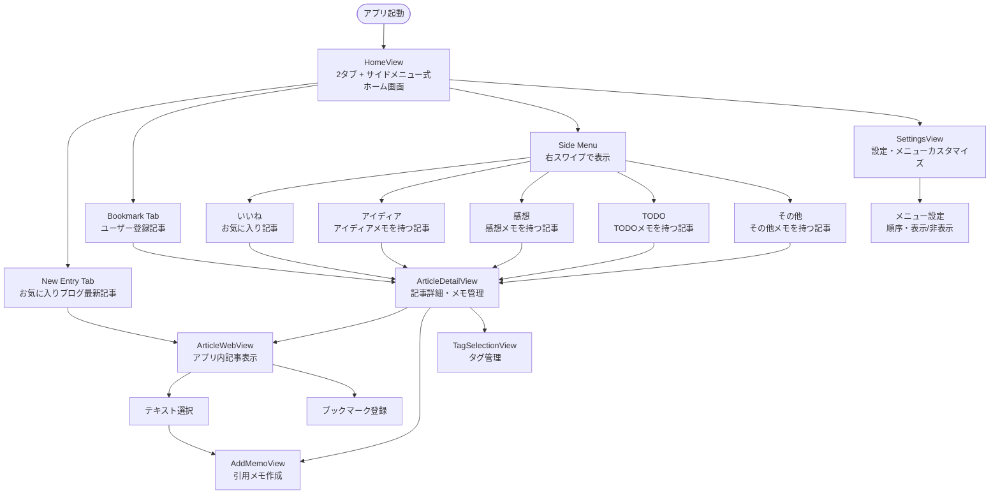

# UseCase Document: Bookmark Manager (Phase 1A - 2タブ + サイドメニューシステム)

## Overview

AIエンジニア向けブックマーク管理アプリのUseCaseドキュメント。2タブ + サイドメニュー式UI（New Entry, Bookmark + サイドメニュー）、アプリ内記事表示、テキスト選択機能、ブックマーク管理機能のユーザー操作フローを定義します。

---

## 🏗️ アプリ構造

```
KiroBookmark App
├── HomeView (2タブ + サイドメニュー式ホーム画面)
│   ├── New Entry Tab (お気に入りブログの最新記事)
│   ├── Bookmark Tab (ユーザー登録記事)
│   └── Side Menu (右スワイプで表示)
│       ├── いいね (お気に入り記事)
│       ├── アイディア (アイディアメモを持つ記事)
│       ├── 感想 (感想メモを持つ記事)
│       ├── TODO (TODOメモを持つ記事)
│       └── その他 (その他メモを持つ記事)
├── ArticleWebView (アプリ内記事表示)
├── ArticleDetailView (記事詳細・メモ管理)
├── AddMemoView (メモ追加・編集)
└── SettingsView (設定・メニューカスタマイズ)
```

---

## 🔄 UseCase一覧

### UC-01: アプリ起動・2タブホーム画面表示
### UC-02: New Entryタブでの記事閲覧
### UC-03: アプリ内記事表示・テキスト選択・ブックマーク登録
### UC-04: Bookmarkタブでの記事管理
### UC-05: サイドメニューによるメモ種類別フィルタリング
### UC-06: 記事詳細表示・メモ管理
### UC-07: メモ追加・編集・削除
### UC-08: タグ管理
### UC-09: 記事お気に入り設定
### UC-10: サイドメニュー設定・カスタマイズ

---

## 📋 UseCase詳細

### UC-01: アプリ起動・2タブホーム画面表示

**概要**: ユーザーがアプリを起動して2タブ + サイドメニューシステムのホーム画面を表示する

**アクター**: AIエンジニア

**事前条件**: 
- アプリがインストールされている
- Core Dataが初期化されている

**基本フロー**:
1. ユーザーがアプリアイコンをタップ
2. アプリが起動する
3. システムがCore Dataからデータを読み込み
4. HomeViewが表示される（デフォルト: New Entryタブ）
5. 2タブ（New Entry, Bookmark）が表示される
6. ヘッダー中央にアプリアイコンが表示される（後日追加）
7. New Entryタブにお気に入りブログの最新記事がカード形式で表示される

**代替フロー**:
- 4a. 初回起動時: チュートリアル表示（Phase 1Bで実装）
- 4b. データ読み込みエラー時: エラーメッセージ表示

**事後条件**: 2タブホーム画面が表示され、ユーザーが操作可能な状態

---

### UC-02: New Entryタブでの記事閲覧

**概要**: お気に入りブログの最新記事を投稿日時順で閲覧する

**アクター**: AIエンジニア

**事前条件**: 
- ホーム画面が表示されている
- お気に入りブログが登録されている（Phase 1Bで実装）

**基本フロー**:
1. ユーザーがNew Entryタブを選択
2. システムがお気に入りブログの最新記事を投稿日時順で表示
3. 各記事がカード形式で表示される（タイトル、URL、サムネイル、投稿日時、経過時間）
4. ユーザーが記事カードをタップ
5. ArticleWebViewが開き、記事が表示される（UC-03へ）

**代替フロー**:
- 2a. お気に入りブログ未登録時: 「お気に入りブログを追加してください」メッセージ表示
- 2b. 記事取得エラー時: エラーメッセージ表示、手動更新ボタン提供

**事後条件**: 最新記事が投稿日時順で表示される

---

### UC-03: アプリ内記事表示・テキスト選択・ブックマーク登録

**概要**: アプリ内WebViewで記事を表示し、テキスト選択して引用メモを作成、スクロール停止時にブックマーク登録する

**アクター**: AIエンジニア

**事前条件**: 
- 記事カードがタップされた
- 記事URLが有効

**基本フロー**:
1. ArticleWebViewが開く
2. 記事URLが読み込まれる
3. ローディングインジケーターが表示される
4. 記事が表示される
5. ユーザーが記事を読みながらスクロール
6. スクロールが停止する
7. フローティングブックマーク登録ボタンが表示される
8. ユーザーがボタンをタップ
9. 記事がブックマークに追加される
10. 確認メッセージが表示される

**代替フロー（テキスト選択）**:
- 5a. ユーザーが記事内のテキストを選択
- 5b. 「引用メモを作成」オプションが表示される
- 5c. ユーザーが「引用メモを作成」をタップ
- 5d. AddMemoViewが開き、選択テキストが自動挿入される
- 5e. ユーザーがメモを保存
- 5f. 引用メモが記事に関連付けられる

**代替フロー（エラー）**:
- 4a. 記事読み込みエラー時: エラーメッセージ表示、リロードボタン提供
- 9a. 重複ブックマーク時: 「既にブックマーク済みです」メッセージ表示

**事後条件**: 記事がアプリ内で表示され、ブックマーク登録またはテキスト選択が可能

---

### UC-04: Bookmarkタブでの記事管理

**概要**: ユーザーが登録した記事を最新アクティビティ順で管理する

**アクター**: AIエンジニア

**事前条件**: 
- ホーム画面が表示されている
- ブックマークが1件以上存在する

**基本フロー**:
1. ユーザーがBookmarkタブを選択
2. システムがユーザー登録記事を最新アクティビティ順で表示
3. 各記事がカード形式で表示される（タイトル、URL、サムネイル、最終アクティビティ日時）
4. ユーザーが記事カードをタップ
5. ArticleDetailViewが開く（UC-06へ）

**代替フロー（スワイプ操作）**:
- 3a. ユーザーが記事カードを左にスワイプ
- 3b. 削除、お気に入り、編集オプションが表示される
- 3c. ユーザーがオプションを選択
- 3d. 選択されたアクションが実行される

**代替フロー（空の状態）**:
- 2a. ブックマーク未登録時: 「記事を追加してください」メッセージ表示

**事後条件**: ユーザー登録記事が最新アクティビティ順で表示される

---

### UC-05: サイドメニューによるメモ種類別フィルタリング

**概要**: 右スワイプでサイドメニューを表示し、メモ種類別に記事をフィルタリングする

**アクター**: AIエンジニア

**事前条件**: 
- ホーム画面が表示されている
- メモが1件以上存在する

**基本フロー**:
1. ユーザーが画面を右にスワイプ
2. サイドメニューがアニメーションで表示される
3. メニュー項目が表示される（いいね、アイディア、感想、TODO、その他）
4. メモが存在しないメニュー項目は自動的に非表示
5. ユーザーがメニュー項目を選択（例: アイディア）
6. サイドメニューが閉じる
7. 選択されたメモ種類を持つ記事のみが表示される
8. 記事がメモ種類別にソートされる

**代替フロー（メニューを閉じる）**:
- 2a. ユーザーが画面を左にスワイプ → サイドメニューが閉じる
- 2b. ユーザーがメニュー外をタップ → サイドメニューが閉じる

**代替フロー（空の状態）**:
- 4a. 全てのメモ種類が存在しない時: 「メモがありません」メッセージ表示

**事後条件**: 選択されたメモ種類を持つ記事のみが表示される

---

### UC-06: 記事詳細表示・メモ管理

**概要**: 記事の詳細情報とメモ種類別一覧を表示し、メモを管理する

**アクター**: AIエンジニア

**事前条件**: 
- 記事カードがタップされた
- 記事が存在する

**基本フロー**:
1. ArticleDetailViewが開く
2. 記事情報が表示される（タイトル、URL、サムネイル、投稿日時）
3. メモ種類別一覧が表示される（アイディア、感想、TODO、引用、その他）
4. 各メモ種類のメモ件数が表示される
5. タグ一覧が表示される
6. お気に入り状態が表示される
7. WebView表示ボタンが表示される
8. ユーザーがメモ種類を選択
9. 選択されたメモ種類のメモ一覧が表示される

**代替フロー（メモ追加）**:
- 8a. ユーザーが「メモ追加」ボタンをタップ
- 8b. AddMemoViewが開く（UC-07へ）

**代替フロー（WebView表示）**:
- 7a. ユーザーがWebView表示ボタンをタップ
- 7b. ArticleWebViewが開く（UC-03へ）

**事後条件**: 記事詳細とメモ種類別一覧が表示される

---

### UC-07: メモ追加・編集・削除

**概要**: 記事に対してメモを追加、編集、削除する

**アクター**: AIエンジニア

**事前条件**: 
- 記事詳細画面が表示されている

**基本フロー（追加）**:
1. ユーザーが「メモ追加」ボタンをタップ
2. AddMemoViewが開く
3. メモ種類選択ピッカーが表示される（アイディア、感想、TODO、引用、その他）
4. ユーザーがメモ種類を選択
5. テキスト入力フィールドが表示される
6. 文字数カウンターが表示される（0/140）
7. ユーザーがメモを入力
8. 文字数カウンターがリアルタイムで更新される
9. ユーザーが「保存」ボタンをタップ
10. メモが記事に関連付けられて保存される
11. AddMemoViewが閉じる
12. 記事詳細画面に戻る

**代替フロー（編集）**:
- 1a. ユーザーが既存メモをタップ
- 1b. AddMemoViewが開き、既存メモ内容が表示される
- 1c. ユーザーがメモを編集
- 1d. ユーザーが「保存」ボタンをタップ
- 1e. メモが更新される

**代替フロー（削除）**:
- 1a. ユーザーがメモを左にスワイプ
- 1b. 削除ボタンが表示される
- 1c. ユーザーが削除ボタンをタップ
- 1d. 確認ダイアログが表示される
- 1e. ユーザーが「削除」を確認
- 1f. メモが削除される

**代替フロー（文字数制限）**:
- 8a. 入力文字数が140文字を超える
- 8b. 入力が制限される
- 8c. エラーメッセージが表示される

**事後条件**: メモが追加、編集、または削除される

---

### UC-08: タグ管理

**概要**: 記事にタグを追加、編集、削除する

**アクター**: AIエンジニア

**事前条件**: 
- 記事詳細画面が表示されている

**基本フロー（追加）**:
1. ユーザーが「タグ追加」ボタンをタップ
2. TagSelectionViewが開く
3. 既存タグ一覧が使用頻度順で表示される
4. ユーザーがタグを選択または新規タグを入力
5. ユーザーが「追加」ボタンをタップ
6. タグが記事に関連付けられる
7. TagSelectionViewが閉じる
8. 記事詳細画面に戻る

**代替フロー（削除）**:
- 1a. ユーザーがタグをタップ
- 1b. 削除確認ダイアログが表示される
- 1c. ユーザーが「削除」を確認
- 1d. タグが記事から削除される

**代替フロー（編集）**:
- 1a. ユーザーがタグを長押し
- 1b. タグ編集ダイアログが表示される
- 1c. ユーザーがタグ名を編集
- 1d. ユーザーが「保存」ボタンをタップ
- 1e. タグ名が更新される
- 1f. 関連するすべての記事のタグが更新される

**事後条件**: タグが追加、編集、または削除される

---

### UC-09: 記事お気に入り設定

**概要**: 記事をお気に入りに設定または解除する

**アクター**: AIエンジニア

**事前条件**: 
- 記事が表示されている（カード、詳細、WebView）

**基本フロー**:
1. ユーザーがお気に入りボタン（ハートアイコン）をタップ
2. お気に入り状態がトグルされる
3. アイコンの色が変わる（未設定: グレー、設定済み: ピンク）
4. お気に入り状態が保存される
5. 最終アクティビティ日時が更新される

**代替フロー（サイドメニューから表示）**:
- 1a. ユーザーがサイドメニューの「いいね」を選択
- 1b. お気に入り設定された記事のみが表示される

**事後条件**: 記事のお気に入り状態が更新される

---

### UC-10: サイドメニュー設定・カスタマイズ

**概要**: サイドメニュー項目の表示順序や表示/非表示をカスタマイズする

**アクター**: AIエンジニア

**事前条件**: 
- 設定画面が表示されている

**基本フロー**:
1. ユーザーが設定画面を開く
2. 「サイドメニュー設定」セクションが表示される
3. メニュー項目一覧が現在の順序で表示される
4. ユーザーがメニュー項目をドラッグ&ドロップ
5. メニュー項目の順序が変更される
6. ユーザーがメニュー項目の表示/非表示スイッチを切り替え
7. メニュー項目の表示状態が変更される
8. ユーザーが「保存」ボタンをタップ
9. 設定が永続化される
10. 設定画面が閉じる

**代替フロー（デフォルトに戻す）**:
- 8a. ユーザーが「デフォルトに戻す」ボタンをタップ
- 8b. 確認ダイアログが表示される
- 8c. ユーザーが「リセット」を確認
- 8d. メニュー設定が初期状態に戻る

**代替フロー（スワイプ操作設定）**:
- 6a. ユーザーが「スワイプ操作を有効にする」スイッチを切り替え
- 6b. スワイプ操作の有効/無効が切り替わる
- 6c. 無効時はメニューボタンによる表示のみ可能

**事後条件**: サイドメニュー設定が更新され、次回起動時に反映される

---

## 🗺️ 画面遷移図（2タブ + サイドメニューシステム対応）



---

## 📐 画面詳細設計（2タブ + サイドメニューシステム対応）

### HomeView (2タブ + サイドメニュー式ホーム画面)

```
┌─────────────────────────────────────────────────────────┐
│                    [アプリアイコン]                      │ ← ヘッダー（後日追加）
├─────────────────────────────────────────────────────────┤
│                                                         │
│  ┌──────────┐┌──────────┐                              │ ← 2タブセレクター
│  │📰 New   ││📚 Book   │                              │
│  │  Entry  ││  mark    │                              │
│  └──────────┘└──────────┘                              │
│                                                         │
│  ┌─────────────────────────────────────────────────┐   │
│  │ 📰 記事タイトル                                  │   │ ← 記事カード
│  │ example.com                                     │   │
│  │ 🏷️ Tag1, Tag2                                   │   │
│  │ ⏰ 2時間前  💬 3メモ  ❤️                        │   │
│  └─────────────────────────────────────────────────┘   │
│                                                         │
│  ┌─────────────────────────────────────────────────┐   │
│  │ 📰 記事タイトル                                  │   │
│  │ example.com                                     │   │
│  │ 🏷️ Tag3                                         │   │
│  │ ⏰ 5時間前  💬 1メモ                            │   │
│  └─────────────────────────────────────────────────┘   │
│                                                         │
└─────────────────────────────────────────────────────────┘

右スワイプ →

┌─────────────────────────────────────────────────────────┐
│ ┌─────────────────┐                                     │
│ │ Side Menu       │                                     │
│ │                 │                                     │
│ │ ❤️ いいね (5)   │                                     │
│ │ 💡 アイディア(3)│                                     │
│ │ 📝 感想 (2)     │                                     │
│ │ ✅ TODO (1)     │                                     │
│ │ ⋯ その他 (0)   │ ← メモ0件は非表示                   │
│ │                 │                                     │
│ │ ⚙️ 設定         │                                     │
│ └─────────────────┘                                     │
└─────────────────────────────────────────────────────────┘
```

**コンポーネント詳細:**
- **2タブセレクター**: New Entry, Bookmark の2タブのみ
- **サイドメニュー**: 右スワイプで表示、メモ種類別フィルタリング
- **記事カード**: VStack + HStack, Corner Radius 12pt, Shadow
- **動的メニュー**: メモ0件の項目は自動非表示

---

## 🎯 Phase 1A 実装範囲

### ✅ 実装対象
- 2タブ + サイドメニュー式ホーム画面
- ブックマーク管理（追加、削除、編集）
- メモ種類別管理（追加、編集、削除、フィルタリング）
- タグ管理（追加、削除、編集）
- アプリ内記事表示（WebView）
- テキスト選択・引用メモ作成
- スクロール停止時ブックマーク登録
- サイドメニュー設定・カスタマイズ
- お気に入り機能

### ❌ Phase 1Bに延期
- RSS自動更新・通知
- 検索機能
- エクスポート機能
- AI要約・タグ推薦
- 写真添付機能
- 関連記事提案

---

このUseCaseドキュメントにより、2タブ + サイドメニューシステムの具体的なユーザー操作フローが完全に定義されました。
